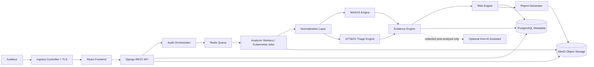

# MSAP Cloud - Cloud-Native Mobile Security Assessment & Triage Platform

**Positionnement**: Plateforme cloud-native d'evaluation de securite mobile et de triage d'APK basee sur OWASP MASVS, MITRE ATT&CK Mobile, MinIO et Kubernetes.

## Executive Summary
MSAP Cloud est un projet d'ingenierie cybersécurité visant a fournir une plateforme cloud-native, auto-hebergeable et open-source pour l'audit applicatif mobile, le triage d'APK et la production de preuves techniques. Le coeur fonctionnel reste l'analyse statique Android, l'evaluation OWASP MASVS, le triage prudent MITRE ATT&CK Mobile, le scoring et le reporting.

MSAP Cloud ne fournit pas de verdict garanti malware/benin. Les indicateurs ATT&CK Mobile soutiennent une revue analyste evidence-first.

## Architecture cible

## Role de MinIO
MinIO est le stockage objet S3-compatible de MSAP Cloud. Il stocke les APK, artefacts d'analyse, preuves, rapports et exports. Il n'heberge pas l'application. PostgreSQL conserve les metadonnees, statuts, scores et references vers les objets MinIO.

## Deploiement
Kubernetes est la plateforme cible de deploiement: namespace `msap`, Ingress HTTPS, Secrets, ConfigMaps, Services, Deployments, workers, Jobs, PVC, NetworkPolicies et packaging Helm. Docker Compose est conserve uniquement pour le developpement local et les tests rapides.

## Perimetre securite
- Android APK uniquement pour le MVP.
- Analyse statique comme coeur fonctionnel.
- OWASP MASVS comme standard d'evaluation AppSec.
- MITRE ATT&CK Mobile comme mapping prudent de triage.
- Evidence-first audit model.
- Pas d'exploitation offensive contre des systemes tiers.
- Pas de classification malware garantie.
- MobSF, Frida et analyse dynamique restent des plugins futurs optionnels.
- Kimi AI reste optionnel, post-analyse, apres redaction, sans acces aux APK bruts.

## Documents cloud-native
- [Decision de pivot cloud-native](docs/00_Cadrage/11_Cloud_Native_Pivot_Decision.md)
- [Architecture cloud-native](docs/03_Architecture/14_Cloud_Native_Architecture.md)
- [Architecture de deploiement Kubernetes](docs/03_Architecture/15_Kubernetes_Deployment_Architecture.md)
- [Architecture MinIO](docs/03_Architecture/16_Object_Storage_MinIO_Architecture.md)
- [Modele de flux de donnees cloud](docs/04_Design/19_Cloud_Data_Flow_Model.md)
- [Modele de ressources Kubernetes](docs/04_Design/20_Kubernetes_Resource_Model.md)
- [Modele de securite multi-tenant](docs/04_Design/21_Multi_Tenant_Security_Model.md)
- [Strategie de deploiement Kubernetes](docs/07_Deployment/19_Kubernetes_Deployment_Strategy.md)
- [Strategie Helm](docs/07_Deployment/20_Helm_Chart_Strategy.md)
- [Strategie MinIO](docs/07_Deployment/21_MinIO_Storage_Strategy.md)
- [Strategie Cloud DevSecOps](docs/07_Deployment/22_Cloud_DevSecOps_Strategy.md)

## Stack technique prevue
Frontend React, Backend Django REST Framework, PostgreSQL, Redis/Celery, workers scalables ou Kubernetes Jobs, MinIO object storage, Kubernetes + Helm. Docker Compose est uniquement un mode de developpement local. Options: Argo CD, Prometheus/Grafana, Trivy, Kimi AI post-analysis assistant.

## Roadmap 8 semaines
| Semaine | Objectif |
|---|---|
| S1 | Cadrage cloud-native & exigences |
| S2 | Architecture Kubernetes + MinIO + design |
| S3 | Backend foundation + PostgreSQL + MinIO integration |
| S4 | Queue + workers + APK ingestion |
| S5 | Analyse statique + normalization |
| S6 | MASVS + ATT&CK engines + evidence |
| S7 | Dashboard + reporting + object exports |
| S8 | Kubernetes deployment + tests + delivery |

## Authorized-Use Disclaimer
MSAP Cloud est une plateforme academique et institutionnelle d'audit cybersécurité. Elle doit etre utilisee uniquement pour analyser des APK avec autorisation explicite. Les resultats de triage ne constituent pas une classification definitive malware/benin et doivent etre interpretes par un analyste.
