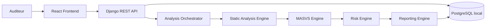

# MSAP - Mobile Security Assessment Platform

## Description du projet

MSAP est une plateforme locale d'evaluation de securite des applications mobiles. Le projet est concu comme un travail d'ingenierie cybersécurité oriente audit, architecture de securite, methodologie et reporting technique.

L'objectif de la Version 1 est de preparer puis developper un socle d'analyse statique pour applications Android au format APK, avec un alignement initial sur OWASP MASVS.

## Positionnement cybersécurité

La plateforme vise a structurer un processus d'audit mobile local:

- extraction d'artefacts APK;
- detection de mauvaises configurations;
- recherche de motifs de code a risque;
- association des constats aux categories OWASP MASVS;
- conservation des preuves;
- generation de rapports d'audit exploitables.

## Perimetre Version 1

- Android APK static analysis uniquement.
- Analyse du manifeste Android.
- Analyse de ressources et configurations.
- Recherche de secrets, URLs HTTP, usages cryptographiques faibles et configurations dangereuses.
- Mapping initial vers OWASP MASVS.
- Reporting local.

## Hors perimetre

- MobSF.
- Android Emulator.
- Services distants.
- Analyse dynamique.
- Instrumentation Frida.
- Analyse iOS.
- Analyse d'applications sans autorisation.

## Vue d'ensemble de l'architecture

L'architecture cible separe le frontend, l'API backend, l'orchestrateur d'analyse, les moteurs statiques, le moteur MASVS, le moteur de risque, le moteur de preuves et le reporting.



## Structure documentaire

```text
docs/
├── 00_Cadrage/
├── 01_Requirements/
├── 02_Security_Methodology/
├── 03_Architecture/
├── 04_Design/
├── 05_Development/
├── 06_Testing/
├── 07_Deployment/
└── 08_Delivery/
```

## Stack technique prevue

- Frontend: React.
- Backend API: Django REST Framework.
- Base de donnees locale: PostgreSQL.
- Analyse Android statique: adaptateurs prevus vers APKTool, JADX et Androguard.
- Regles: catalogue YAML.
- Reporting: generation locale de rapports.
- Deploiement: Docker local dans une phase ulterieure.

## Philosophie de deploiement local

MSAP est concu selon une approche **local-first**. Les APK, artefacts, preuves et rapports doivent rester sur la machine de l'utilisateur. Aucun service distant n'est requis dans le perimetre de la Version 1.

## Synthese de la roadmap

| Phase | Objectif |
|---|---|
| Semaine 1 | Cadrage, exigences, methodologie, architecture |
| Semaine 2 | Conception detaillee, backlog, regles initiales |
| Semaines 3-4 | Socle backend, import APK, extraction des artefacts |
| Semaines 5-6 | Regles statiques, MASVS, scoring, preuves |
| Semaine 7 | Interface, dashboard, generation de rapports |
| Semaine 8 | Tests, stabilisation, documentation finale, soutenance |

## Avertissement

MSAP est une plateforme academique d'audit cybersécurité destinee a l'analyse autorisee d'applications mobiles. Elle doit etre utilisee uniquement dans un cadre legal, ethique et contractuellement autorise.
