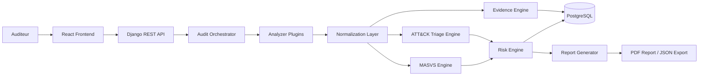

# MSAP - Mobile Security Assessment & Triage Platform

**Sous-titre**: Plateforme locale d'evaluation de securite mobile et de triage d'APK basee sur OWASP MASVS et MITRE ATT&CK Mobile.

## Executive Summary

MSAP est un projet d'ingenierie cybersécurité visant a fournir une plateforme locale d'audit applicatif mobile et de triage d'APK. La Version 1 se concentre sur l'analyse statique Android afin d'identifier des faiblesses AppSec, des indicateurs suspects et des preuves techniques exploitables dans un rapport d'audit.

La plateforme combine deux angles complementaires:

- **OWASP MASVS** pour l'evaluation de securite applicative mobile.
- **MITRE ATT&CK Mobile** pour le triage oriente menace d'indicateurs observables dans un APK.

MSAP ne fournit pas un verdict garanti malware/benin. Les indicateurs ATT&CK Mobile servent a soutenir une revue analyste.

## Problem Statement

Les equipes academiques et institutionnelles ont besoin d'un environnement local pour analyser des APK sans exposer les fichiers a des services distants. Les outils existants peuvent etre puissants, mais ils sont parfois trop larges, dependants de plateformes externes ou insuffisamment adaptes a une demarche PFA structuree autour de preuves, scoring, conformite et triage.

MSAP repond a ce besoin en proposant une architecture locale, modulaire et documentee pour conduire une analyse statique Android reproductible.

## Positionnement Cybersécurité

MSAP est positionne comme une plateforme de security engineering, pas comme un simple projet web. Les priorites sont:

- audit applicatif mobile;
- analyse statique Android;
- triage d'APK suspects;
- evidence-based audit;
- mapping OWASP MASVS;
- mapping MITRE ATT&CK Mobile;
- risk scoring et compliance scoring;
- deploiement local sur poste institutionnel.

## Perimetre Version 1

- Android APK uniquement.
- Analyse statique uniquement.
- Analyse locale sans service distant.
- Upload et validation d'APK.
- Calcul SHA-256.
- Extraction des metadonnees APK.
- Analyse `AndroidManifest.xml`.
- Extraction des permissions.
- Detection des composants exportes.
- Extraction des metadonnees certificat et signature.
- Extraction des ressources, chaines, URLs, IPs, domaines et secrets potentiels.
- Inspection du code decompile lorsque possible.
- Findings AppSec mappes OWASP MASVS.
- Indicateurs suspects mappes MITRE ATT&CK Mobile lorsque applicable.
- Evidence, risk score, compliance score.
- Rapport PDF et export JSON.
- Deploiement Docker Compose local.

## Hors Perimetre V1

- Toute dependance a MobSF.
- Frida.
- Android Emulator.
- Analyse dynamique.
- Malware sandbox.
- Classification garantie malware/benin.
- Support iOS/IPA.
- Exploitation offensive ou tests intrusifs contre des systemes tiers.

## Approche Hybride

### OWASP MASVS

Le moteur MASVS structure les constats de securite applicative: stockage, reseau, crypto, plateforme, confidentialite, authentification et resilience.

### MITRE ATT&CK Mobile

Le moteur ATT&CK Triage mappe certains indicateurs statiques vers des tactiques et techniques mobiles. Ces indicateurs peuvent appuyer une priorisation analyste, mais ne constituent pas une preuve definitive de malveillance.

## Architecture Overview



## Modules Fonctionnels

1. Project and audit management.
2. APK ingestion.
3. Local Android static analysis.
4. AppSec detection engine.
5. Threat triage engine.
6. MASVS mapping engine.
7. MITRE ATT&CK Mobile mapping engine.
8. Risk engine.
9. Evidence engine.
10. Reporting engine.

## Documentation Structure

```text
docs/
├── 00_Cadrage/
├── 01_Requirements/
├── 02_Security_Methodology/
├── 03_Architecture/
├── 04_Design/
├── 05_Development/
├── 06_Testing/
├── 07_Deployment/
└── 08_Delivery/
```

## Stack Technique Prevue

- Frontend: React.
- Backend: Django REST Framework.
- Base locale: PostgreSQL.
- Analyse Android: APKTool, JADX, Androguard, regles regex/YARA optionnelles.
- Reporting: PDF et JSON.
- Deploiement: Docker Compose local.

## Contraintes Local-First et ARM64

MSAP doit rester deployable sur un poste institutionnel, y compris en environnement Ubuntu WSL et machines ARM64 lorsque possible. Les dependances doivent etre choisies avec prudence, sans imposer MobSF, emulateur Android ou service externe. Les outils non disponibles en ARM64 doivent avoir une alternative documentee ou rester optionnels.

## Roadmap Summary

| Semaine | Objectif |
|---|---|
| S1 | Cadrage & exigences |
| S2 | Architecture & design |
| S3 | Socle backend/frontend |
| S4 | Analyse APK locale |
| S5 | Detections AppSec |
| S6 | MASVS + ATT&CK engines |
| S7 | Dashboard & reporting |
| S8 | Qualite & livraison |

## Authorized-Use Disclaimer

MSAP est une plateforme academique et institutionnelle d'audit cybersécurité. Elle doit etre utilisee uniquement pour analyser des APK avec autorisation explicite. Les resultats de triage ne constituent pas une classification definitive malware/benin et doivent etre interpretes par un analyste.
