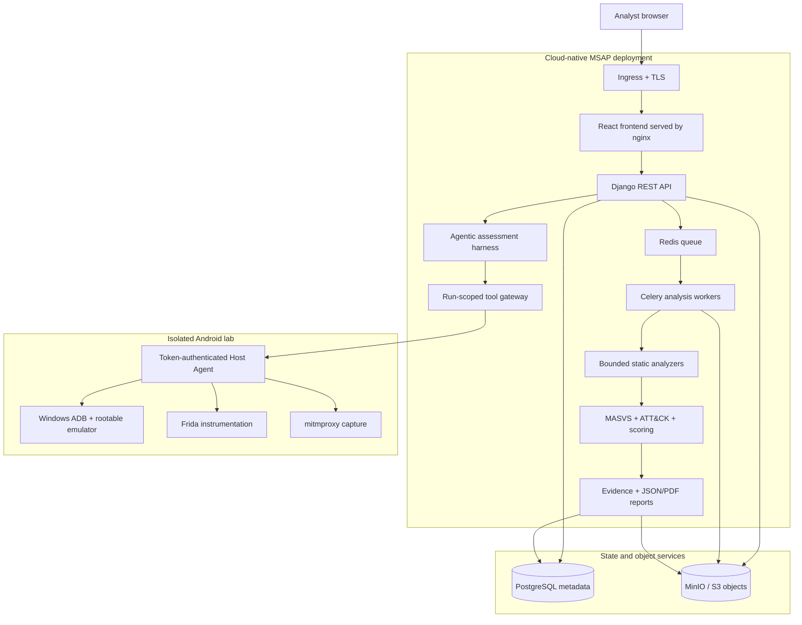

# MSAP

Mobile Security Assessment & Triage Platform (MSAP) is a cloud-native,
self-hosted platform for authorized Android APK security assessments. It
combines deterministic static analysis, OWASP MASVS-oriented findings, cautious
MITRE ATT&CK Mobile triage, evidence handling, risk scoring, PDF/JSON reporting,
and an isolated Android dynamic-analysis lab.

MSAP also includes a custom agentic assessment harness: a bounded planning,
approval, execution, observation, and evidence-correlation loop that can use
deterministic logic or live OpenAI Responses API calls, including the
`gpt-5.6-luna` economy profile. A model never receives direct ADB, Frida, shell,
filesystem, Docker, database, or object-storage access.

MSAP does not claim to prove that an application is benign or malicious.
Findings and ATT&CK mappings are decision support for a qualified analyst.

## What is implemented

- Django REST API with server-side session authentication, CSRF protection,
  role-based access control, PostgreSQL metadata, and MinIO object storage.
- Celery/Redis orchestration for bounded APK analysis and report generation.
- Android manifest, DEX, resource, string, certificate, and optional JADX
  source indexing with deterministic rule evaluation.
- Explainable severity, confidence, MASVS coverage, and audit scoring.
- React, TypeScript, and Vite analyst interface.
- Local Android dynamic lab using a rootable API 35 emulator, Windows ADB,
  Frida, mitmproxy, runtime-only CA injection, and a token-authenticated Host
  Agent with allowlisted operations.
- An implemented, operational agentic assessment harness for bounded planning
  and adaptive decisions. It supports both offline deterministic execution and
  real OpenAI Responses API execution, including `gpt-5.6-luna`, while remaining
  backend-only and constrained by approval, capability, call, time, artifact,
  and redaction policies.
- Docker Compose for development/demo and a Helm chart for Kubernetes.

## Cloud-native design

MSAP is cloud-native at the application and data-orchestration layers while
keeping privileged Android instrumentation in an isolated lab outside the
cluster.

| Concern | Implementation |
| --- | --- |
| Web tier | Independently packaged React/nginx frontend and Django API images |
| Asynchronous work | Redis-backed Celery workers separate long-running APK analysis from API requests |
| Metadata | PostgreSQL stores tenants, projects, audits, states, findings, scores, and object references |
| Binary objects | Private MinIO/S3 buckets hold APKs, artifacts, evidence, reports, and exports |
| Deployment | Helm packages frontend, API, worker, Services, Ingress, service accounts, configuration, Secrets, and initialization Jobs |
| Operations | Health probes, deterministic migrations, idempotent bucket initialization, immutable application images, and environment-driven configuration |
| Scaling boundary | Stateless frontend/API replicas and Celery workers can scale separately from PostgreSQL, Redis, and object storage |
| Local parity | Compose runs the same principal services for development without redefining the production architecture |

Large or sensitive binaries do not pass through PostgreSQL. Application records
contain bounded metadata and `ObjectStorageReference` identities, while MinIO
owns object bytes and presigned access. API requests, background work, evidence,
and reports therefore share one traceable audit identity without coupling the
web process to a local filesystem.

The included PostgreSQL, Redis, and MinIO workloads are useful for a lab or
small installation. A production deployment should normally use backed-up,
separately operated stateful services and externally managed Kubernetes Secrets.

## Cloud-native system architecture



The Host Agent is deliberately outside the application containers because ADB,
the emulator, Frida, and proxy tooling belong to the isolated workstation lab.
It accepts a short allowlist of authenticated actions; it is not a remote shell.

## Agentic assessment harness

The agentic harness is implemented end to end and operational. It supports the
offline deterministic provider and live OpenAI Responses API calls; its economy
profile uses `gpt-5.6-luna`. It is not a general-purpose autonomous agent or a
model connected directly to tools. It is a custom, in-repository security
harness built around Django contracts and persisted audit state. Model output
is treated as untrusted input and must cross the same validation and
authorization boundaries as browser input.

```mermaid
flowchart LR
    OBJ[Analyst objective and audit scope] --> CTX[Sanitized trusted/untrusted context]
    CTX --> PLAN[Deterministic or OpenAI planner]
    PLAN --> VALIDATE[Strict plan schema and policy validation]
    VALIDATE --> APPROVE[Analyst approval and playbook authorization]
    APPROVE --> CAP[Capability envelope]
    CAP --> EXEC[Bounded controller and executor]
    EXEC --> GW[Run-scoped Tool Gateway]
    GW --> HA[Authenticated Host Agent]
    HA --> TOOLS[Allowlisted ADB, UI, Frida, logcat, screenshot, and proxy actions]
    TOOLS --> EVID[Normalized evidence and artifacts]
    EVID --> ORACLE[Oracles and static/dynamic correlation]
    ORACLE --> DECIDE[Bounded adaptive decision]
    DECIDE -->|approved next step| EXEC
    DECIDE --> RESULT[Persisted result and coverage gaps]
```



The harness consists of:

| Component | Responsibility and boundary |
| --- | --- |
| Context builder | Reads bounded persisted APK metadata, findings, evidence, device state, objective, and scope; separates trusted controls from attacker-influenceable application observations and redacts common credential forms |
| Planner provider | Supports the offline deterministic planner and live OpenAI Responses API execution; the economy profile uses `gpt-5.6-luna`, strict JSON-schema output, no provider-hosted tools, and disabled provider storage |
| Plan contract and validator | Reject unknown tools/fields, malformed arguments, dependency cycles, arbitrary Frida source, unauthorized packages, excessive work, credential instructions, and shell/path/environment/Docker requests |
| Approval and playbook authorization | Requires the requester, audit, APK, objective, plan hash, playbook, and approval state to agree before execution |
| Capability envelope | Reduces the available action set to the intersection of policy, role, approved plan, playbook, lab health, and currently implemented capabilities |
| Controller and executor | Runs persisted steps in order with bounded retries, time, tool calls, provider calls, artifacts, evidence records, observation bytes, and failure thresholds |
| Adaptive decision provider | May select only a schema-valid next action from the remaining approved capabilities; it cannot expand scope, invent a tool, approve itself, or recurse into another planner |
| Run-scoped Tool Gateway | Accepts a short-lived credential stored by Django only as a digest and bound to one run, its current step, exact tool, and resolved arguments |
| Host Agent | Holds the separate backend-to-lab token and translates typed requests into fixed subprocess argument lists and allowlisted emulator operations; it exposes no general shell endpoint |
| Evidence and oracle layer | Normalizes bounded outputs, records provenance and coverage gaps, evaluates expected observations, and correlates runtime evidence with deterministic static findings |
| Isolated execution sandbox | Runs a non-root, read-only, capability-dropped container with bounded CPU, memory, PIDs, lifetime, and a small `noexec` temporary filesystem; it receives only a run token and gateway URL |

This produces an evidence-centered loop rather than an autonomous exploitation
loop. The planner proposes; backend policy validates; the analyst approves; the
capability envelope limits; the gateway and Host Agent enforce; and evidence
oracles determine what was actually observed. Missing visibility becomes
`NOT_EVALUATED`, `REVIEW_REQUIRED`, or an explicit coverage gap—never an
invented pass or vulnerability.

Deterministic static findings and their evidence remain authoritative.
AI-backed planning, adaptive decisions, script proposals, and evidence
explanations are labelled by provider and cannot change MASVS results, risk
scoring, authorization, or raw evidence. See the
[agentic architecture](docs/03_Architecture/40_Agentic_Dynamic_Assessment_Architecture.md)
and [sandbox runtime](agent_runtime/README.md) for the detailed contracts.

## Quick start with Docker Compose

Requirements: Git, Docker Engine/Desktop with Compose v2, and enough disk for
PostgreSQL and MinIO volumes.

```bash
cp .env.compose.example .env
docker compose up --build
docker compose exec backend python manage.py createsuperuser
```

The values in `.env.compose.example` are local-development placeholders. Before
exposing the stack beyond loopback, replace every password, token, MinIO key,
and `DJANGO_SECRET_KEY`. `.env` is ignored by Git.

Local endpoints:

| Service | URL |
| --- | --- |
| Frontend | `http://127.0.0.1:5173` |
| API | `http://127.0.0.1:8000/api/` |
| API documentation | `http://127.0.0.1:8000/api/docs/` |
| Health | `http://127.0.0.1:8000/api/health/` |
| MinIO API | `http://127.0.0.1:9000` |
| MinIO console | `http://127.0.0.1:9001` |

Useful commands:

```bash
docker compose ps
docker compose logs -f backend worker
docker compose down
```

`docker compose down -v` also deletes the local PostgreSQL, Redis, MinIO, and
frontend dependency volumes. Use it only when a complete local data reset is
intended.

## Dynamic Android lab

The dynamic lab is not created by `docker compose up`. It requires Windows with
WSL2, Android Studio/SDK, a rootable AOSP emulator, and local Frida/mitmproxy
tooling. The repository contains the launch, provisioning, bridge, cleanup, and
health scripts; generated CA keys, emulator snapshots, APKs, flows, screenshots,
and runtime evidence intentionally remain outside Git.

For a new or replacement machine, follow the complete
[workstation recovery guide](docs/21_Workstation_Recovery_Guide.md). To delegate
that setup, give a coding agent [CODING_AGENT_LAB_SETUP.md](CODING_AGENT_LAB_SETUP.md).
Normal lab operation is documented in the
[dynamic lab runbook](docs/07_Deployment/31_Dynamic_Lab_Operations_Runbook.md).

After the one-time setup:

```bash
scripts/dynamic-lab/launch-emulator-from-wsl.sh
scripts/dynamic-lab/restore-instrumented-snapshot.sh
scripts/dynamic-lab/lab-health.sh
```

Only analyze APKs for which you have explicit authorization.

## Local source development

```bash
python3 -m venv backend/.venv
backend/.venv/bin/python -m pip install -r backend/requirements.txt
npm ci --prefix frontend
```

Then either use Compose or the managed local demo launcher described in
[docs/20_MVP_Demo_Runbook.md](docs/20_MVP_Demo_Runbook.md). Contributor commands,
settings, and validation checks are in the
[development guide](docs/10_Development_Guide.md).

## Kubernetes and Helm

Kubernetes is the deployment target; Compose is the local workflow. The chart
can deploy the API, worker, nginx-served frontend, migration and MinIO init jobs,
and optional embedded PostgreSQL, Redis, and MinIO services.

```bash
helm lint --strict helm/msap
helm upgrade --install msap ./helm/msap --namespace msap --create-namespace
```

Use an externally managed Kubernetes Secret for production credentials. Do not
place credential-bearing URLs or secret values in committed values files.
Embedded stateful services are suitable for demonstrations and small
installations; production environments should provide backups and separately
operated stateful services. See [helm/msap/README.md](helm/msap/README.md).

## Security and repository hygiene

- Real `.env` files, local databases, APKs, private keys/certificates, proxy
  flows, packet captures, evidence, reports, and runtime directories are
  ignored.
- Example environment files contain placeholders only. Deterministic AI modes
  are the safe offline default in those examples.
- Browser code must never receive provider keys, MinIO credentials, or the Host
  Agent token. Never prefix a secret with `VITE_`.
- The mitmproxy private CA and Android snapshots are machine-local security
  material. Do not back them up to the source repository.
- Scan the tracked tree before every release; add `--history` for all reachable
  commits:

```bash
scripts/security/scan-secrets.sh
scripts/security/scan-secrets.sh --history
```

The built-in scanner detects common high-confidence credential formats and
forbidden tracked artifacts. It complements review and a dedicated secret
scanner; it cannot prove that an arbitrary custom credential is absent. If a
real credential is ever committed, revoke/rotate it first, then clean Git
history and notify every clone owner.

## Documentation map

- [Project brief](docs/00_Project_Brief.md)
- [Requirements](docs/01_Requirements.md)
- [Security methodology and scoring](docs/02_Methodology.md)
- [Architecture](docs/03_Architecture.md)
- [Agentic dynamic-assessment architecture](docs/03_Architecture/40_Agentic_Dynamic_Assessment_Architecture.md)
- [Data and object-storage model](docs/04_Data_Model.md)
- [API contract](docs/05_API_Contract.md)
- [Rules schema](docs/06_Rules_Schema.md)
- [Environment variables](docs/08_Environment_Variables.md)
- [Development guide](docs/10_Development_Guide.md)
- [Testing](docs/11_Testing.md)
- [Platform security](docs/12_Security_Platform.md)
- [GitLab CI/CD](docs/18_GitLab_CICD.md)
- [Demo runbook](docs/20_MVP_Demo_Runbook.md)
- [Replacement-machine recovery](docs/21_Workstation_Recovery_Guide.md)

Superseded planning material is retained under [docs/archive](docs/archive/README.md)
and is not the implementation contract.

## Authorized-use disclaimer

MSAP is an academic and institutional cybersecurity assessment platform. Use it
only on applications and systems you are explicitly authorized to test. Dynamic
instrumentation and traffic inspection can alter application behavior; keep the
lab isolated and have an analyst validate all conclusions.
