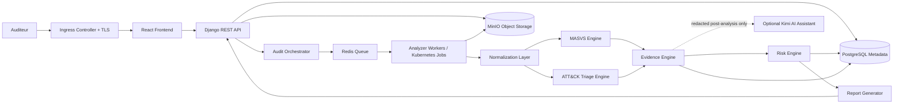

# MSAP

Mobile Security Assessment & Triage Platform

**Positionnement**: Plateforme cloud-native d'evaluation de securite mobile et de triage d'APK basee sur OWASP MASVS, MITRE ATT&CK Mobile, MinIO et Kubernetes.

## Executive Summary
MSAP est un projet d'ingenierie cybersécurité visant a fournir une plateforme cloud-native, auto-hebergeable et open-source pour l'audit applicatif mobile, le triage d'APK et la production de preuves techniques. Le coeur fonctionnel reste l'analyse statique Android, l'evaluation OWASP MASVS, le triage prudent MITRE ATT&CK Mobile, le scoring et le reporting.

MSAP ne fournit pas de verdict garanti malware/benin. Les indicateurs ATT&CK Mobile soutiennent une revue analyste evidence-first.

## Architecture cible



## Deploiement
Kubernetes est la plateforme cible de deploiement: namespace `msap`, Ingress HTTPS, Secrets, ConfigMaps, Services, Deployments, workers, Jobs, PVC, NetworkPolicies et packaging Helm. Docker Compose est conserve uniquement pour le developpement local et les tests rapides.

## Docker Compose development stack

The repository includes a development/demo stack with PostgreSQL, Redis, MinIO,
automatic MinIO initialization, Django, a Celery worker, and the Vite frontend.
Kubernetes remains the production deployment target.

Create the local environment file and start the full stack:

```bash
cp .env.compose.example .env
docker compose up --build
```

The example values are intentionally development-only. Change them if the stack
is reachable by other machines, and never reuse them in production.

Service URLs:

- Frontend: `http://localhost:5173`
- Backend: `http://localhost:8000`
- API documentation: `http://localhost:8000/api/docs/`
- Backend health: `http://localhost:8000/api/health/`
- MinIO API: `http://localhost:9000`
- MinIO console: `http://localhost:9001`

Compose uses one private default network. Containers address PostgreSQL, Redis,
and MinIO by their service names (`postgres`, `redis`, and `minio`). The backend
therefore uses `MINIO_ENDPOINT=http://minio:9000` for object metadata and
downloads. Presigned URLs are generated with
`MINIO_PUBLIC_ENDPOINT=http://localhost:9000`, which is reachable from the host
browser. Outside Compose, the public endpoint falls back to `MINIO_ENDPOINT`.

The one-shot `minio-init` service waits for MinIO and creates the five configured
buckets when absent. It is idempotent and does not enable anonymous access.
Community MinIO does not implement the S3 per-bucket CORS API, so Compose uses
its supported cluster-wide `MINIO_API_CORS_ALLOW_ORIGIN` setting with only the
two Vite development origins—never `*`. The intended narrow APK-bucket policy,
including its required methods and headers, is retained in
`docker/minio/cors.xml` for compatible S3 deployments. The backend waits for
healthy dependencies, runs migrations and rule validation, then starts Django.
The worker starts after the backend is healthy.

The backend initialization also runs the idempotent `bootstrap_roles` command.
It creates the `MSAP_ADMIN`, `MSAP_ANALYST`, and `MSAP_VIEWER` groups but never
creates a user or stores an administrator password. Create the first administrator:

```bash
docker compose exec backend python manage.py createsuperuser
```

The web application uses Django server-side sessions and CSRF protection.
Browser requests include credentials; no JWT, password, session identifier, or
authentication token is stored in browser storage.

Useful lifecycle commands:

```bash
docker compose ps
docker compose logs -f backend
docker compose logs -f worker
docker compose down
```

To completely reset the development databases and object storage:

```bash
docker compose down -v
```

`down -v` permanently deletes the Compose PostgreSQL, Redis, MinIO, and frontend
dependency volumes.

For the first end-to-end check, open the frontend, create a project and audit,
upload an authorized APK, start analysis, wait for status polling to complete,
then review findings, ATT&CK triage indicators, evidence, scores, and the JSON
report or download the PDF security report.

## Kubernetes and Helm deployment

Docker Compose remains the local development/demo workflow. Kubernetes is the
deployment target, packaged by the baseline chart in
[helm/msap](helm/msap/README.md).

Build and publish the production backend and frontend images to a registry that
your cluster can pull from, provide production credentials outside Git, then
install or upgrade:

```bash
helm upgrade --install msap ./helm/msap \
  --namespace msap \
  --create-namespace
```

The chart deploys the Django API, Celery worker, nginx-served React frontend,
optional single-instance PostgreSQL, Redis and MinIO, persistent storage,
health probes, migration and MinIO initialization Jobs, and optional Ingress.
The worker reuses the backend image. Embedded stateful services suit a
demonstration or small installation; production should prefer separately
operated stateful services and externally managed Secrets.

The backend uses the internal Kubernetes MinIO Service for object operations.
`minio.publicEndpoint` must be externally reachable because it is embedded in
browser-facing presigned URLs. The chart never exposes the MinIO administrative
console through Ingress.

Uninstall application resources with:

```bash
helm uninstall msap --namespace msap
```

PVCs may be retained by the cluster and should be reviewed separately before
deletion.

## Backend status
The backend provides authenticated/RBAC APIs, bounded asynchronous APK analysis,
complete evaluation-state tracking, deterministic findings and ATT&CK triage,
system-component status, MinIO storage, explainable scoring, and JSON/PDF reports.

## Frontend

A professional React, TypeScript, and Vite cybersecurity workspace is available
in [frontend](frontend/README.md). It includes secure login, role-aware
navigation, a live architecture status bar, dashboards, finding and ATT&CK
triage workspaces, audit progress and coverage, and report downloads.

Run the backend separately, then start the dashboard:

```bash
cd frontend
cp .env.example .env
npm install
npm run dev
```

The default API base URL is `http://127.0.0.1:8000/api` and can be changed with `VITE_API_BASE_URL`.

PDF reports are generated on demand at
`GET /api/audits/{audit_id}/report/pdf/` using ReportLab and in-memory
`BytesIO`. They contain a cover, executive and scoring summaries, methodology,
APK metadata, findings, ATT&CK Mobile triage signals, bounded evidence,
limitations, and a technical appendix. They use only persisted deterministic
MSAP results, contain no AI-generated content, perform no dynamic execution,
and do not claim a malware verdict. The JSON report endpoint remains available.

## Perimetre securite
- Android APK uniquement pour le MVP.
- Analyse statique comme coeur fonctionnel.
- OWASP MASVS comme standard d'evaluation AppSec.
- MITRE ATT&CK Mobile comme mapping prudent de triage.
- Evidence-first audit model.
- Pas d'exploitation offensive contre des systemes tiers.
- Pas de classification malware garantie.
- MobSF, Frida et analyse dynamique restent des plugins futurs optionnels.
- Kimi AI reste optionnel, post-analyse, apres redaction, sans acces aux APK bruts.

## Active documentation
The active implementation baseline is intentionally small:

- [Project brief](docs/00_Project_Brief.md)
- [Requirements](docs/01_Requirements.md)
- [Security methodology](docs/02_Methodology.md)
- [Architecture](docs/03_Architecture.md)
- [Data and storage model](docs/04_Data_Model.md)
- [API contract](docs/05_API_Contract.md)
- [Rules schema](docs/06_Rules_Schema.md)
- [MVP freeze](docs/07_MVP_Freeze.md)
- [Environment variables](docs/08_Environment_Variables.md)
- [Helm values contract](docs/09_Helm_Values.md)
- [Development guide](docs/10_Development_Guide.md)
- [Testing](docs/11_Testing.md)
- [Security platform operations and analysis scope](docs/12_Security_Platform.md)

Earlier detailed planning and diagram documents are preserved under [docs/archive](docs/archive/README.md) for reference only.

## Stack technique prevue
Frontend React, Backend Django REST Framework, PostgreSQL, Redis/Celery, workers scalables ou Kubernetes Jobs, MinIO object storage, Kubernetes + Helm. Docker Compose est uniquement un mode de developpement local. Options: Argo CD, Prometheus/Grafana, Trivy, Kimi AI post-analysis assistant.

## Roadmap 8 semaines
| Semaine | Objectif |
|---|---|
| S1 | Cadrage cloud-native & exigences |
| S2 | Architecture Kubernetes + MinIO + design |
| S3 | Backend foundation + PostgreSQL + MinIO integration |
| S4 | Queue + workers + APK ingestion |
| S5 | Analyse statique + normalization |
| S6 | MASVS + ATT&CK engines + evidence |
| S7 | Dashboard + reporting + object exports |
| S8 | Kubernetes deployment + tests + delivery |

## Authorized-Use Disclaimer
MSAP est une plateforme academique et institutionnelle d'audit cybersécurité. Elle doit etre utilisee uniquement pour analyser des APK avec autorisation explicite. Les resultats de triage ne constituent pas une classification definitive malware/benin et doivent etre interpretes par un analyste.
