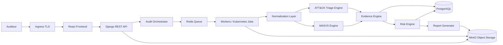

# Note de Cadrage - MSAP 

## Project Title
**MSAP - Cloud-Native Mobile Security Assessment & Triage Platform**

## Product Identity
MSAP est une plateforme cloud-native d'evaluation de securite mobile et de triage d'APK basee sur OWASP MASVS, MITRE ATT&CK Mobile, MinIO et Kubernetes.

## Contexte et justification
Les organisations ont besoin d'une plateforme d'audit mobile capable de traiter des APK sensibles, de conserver les preuves, de tracer les analyses et de s'integrer dans une infrastructure institutionnelle. Le pivot cloud-native permet de passer d'un prototype local a une architecture scalable, auditable et auto-hebergeable.

## Problem Statement
Les analyses APK restent souvent dispersees entre outils, scripts et rapports manuels. MSAP Cloud centralise l'analyse statique Android, le mapping MASVS, le triage ATT&CK Mobile, les preuves et le reporting dans une architecture Kubernetes avec stockage objet MinIO et metadonnees PostgreSQL.

## Objectif general
Concevoir une plateforme cloud-native de security engineering pour l'analyse statique Android, l'evaluation MASVS, le triage ATT&CK Mobile, le scoring, la preuve et le reporting.

## Objectifs operationnels
- Ingerer des APK via API securisee.
- Stocker APK, artefacts, preuves, rapports et exports dans MinIO.
- Stocker metadonnees, statuts, scores et references objet dans PostgreSQL.
- Executer les analyses via Redis/Celery workers ou Kubernetes Jobs.
- Produire findings MASVS et indicateurs ATT&CK Mobile prudents.
- Garantir la tracabilite evidence-first.
- Deployer via Kubernetes et Helm.

## Perimetre V1
Android APK, analyse statique, upload securise, hash SHA-256, extraction manifeste/permissions/composants/signatures/ressources/chaines, detection AppSec, triage ATT&CK Mobile, preuves, scores, rapports PDF, exports JSON, MinIO, PostgreSQL, Redis/workers et manifests Kubernetes/Helm.

## Hors perimetre V1
MobSF obligatoire, Frida, emulateur Android, analyse dynamique, malware sandbox, classification garantie malware/benin, support iOS/IPA, exploitation offensive ou tests intrusifs contre des systemes tiers.

## Architecture cible

## Technologies et contraintes
Python/Django REST, React, PostgreSQL, Redis/Celery, MinIO, Kubernetes, Helm, Ingress TLS, Kubernetes Secrets, APKTool/JADX/Androguard, Trivy optionnel, Prometheus/Grafana optionnels. Docker Compose est limite au developpement local.

## Roadmap
| Semaine | Objectif |
|---|---|
| S1 | Cadrage cloud-native & exigences |
| S2 | Architecture Kubernetes + MinIO + design |
| S3 | Backend foundation + PostgreSQL + MinIO integration |
| S4 | Queue + workers + APK ingestion |
| S5 | Analyse statique + normalization |
| S6 | MASVS + ATT&CK engines + evidence |
| S7 | Dashboard + reporting + object exports |
| S8 | Kubernetes deployment + tests + delivery |

## Risques et mitigation
| Risque | Mitigation |
|---|---|
| Complexite Kubernetes | Helm, manifests limites, kind/K3s pour validation |
| Exposition d'objets sensibles | Buckets prives, RBAC, URLs courtes, logs audites |
| Fuite de secrets | Kubernetes Secrets, rotation, pas de secrets commites |
| Workers instables | Retries bornes, statuts explicites, ressources limitees |
| Confusion triage/verdict | Wording prudent, validation analyste, disclaimer |

## Conclusion
MSAP Cloud devient une plateforme cloud-native de cybersécurité orientee architecture, preuve et analyse statique Android. Kubernetes est la cible de deploiement, MinIO le stockage objet, Docker Compose un outil de developpement local.
