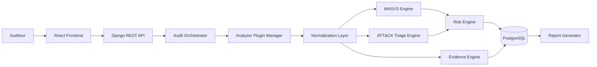

# Note de Cadrage - MSAP

## Project Title

**MSAP - Mobile Security Assessment & Triage Platform**

## Product Identity

MSAP est une plateforme locale d'evaluation de securite mobile et de triage d'APK basee sur OWASP MASVS et MITRE ATT&CK Mobile.

## Context and Justification

Les applications Android circulent dans des contextes institutionnels, academiques et professionnels ou la confidentialite des APK est importante. Les audits mobiles doivent couvrir les faiblesses AppSec classiques, mais aussi fournir un premier triage d'indicateurs suspects lorsque l'origine ou le comportement potentiel d'un APK doit etre qualifie.

Une plateforme locale, documentee et reproductible permet de structurer ce travail sans transmettre les APK a des services distants.

## Problem Statement

Les analyses APK sont souvent realisees avec des outils isoles, des scripts ponctuels ou des rapports manuels. Cela limite la tracabilite, la comparaison des resultats, le mapping vers des standards reconnus et la gestion des faux positifs.

MSAP doit centraliser l'analyse statique locale, produire des preuves, mapper les constats AppSec vers OWASP MASVS et mapper certains indicateurs suspects vers MITRE ATT&CK Mobile sans pretendre fournir une classification malveillante definitive.

## General Objective

Concevoir une plateforme d'audit locale pour l'analyse statique Android, l'evaluation MASVS, le triage ATT&CK Mobile, le scoring et le reporting.

## Operational Objectives

- Ingerer et valider des APK localement.
- Calculer les hashes et extraire les metadonnees.
- Extraire manifeste, permissions, composants, ressources, chaines, signatures et code decompile lorsque possible.
- Detecter des faiblesses AppSec.
- Detecter des indicateurs suspects pour triage analyste.
- Produire des preuves normalisees.
- Calculer risk score et compliance score.
- Generer un rapport PDF et un export JSON.

## Cybersecurity Positioning

MSAP est un projet de security engineering: architecture locale, moteurs de detection, normalisation des artefacts, evidence-based audit, scoring, reporting et deploiement controlé.

## Functional Scope V1

- Android APK only.
- Static analysis only.
- Local analysis.
- APK upload and validation.
- SHA-256 hash calculation.
- APK metadata, manifest, permissions, components, signatures, resources and string extraction.
- Decompiled code inspection where possible.
- Secrets, URLs, IPs, domains and sensitive string detection.
- MASVS findings and ATT&CK Mobile suspicious indicators.
- PDF report and JSON export.

## Out-of-Scope V1

- MobSF dependency.
- Frida.
- Android Emulator.
- Dynamic analysis.
- Malware sandbox.
- Guaranteed malicious/benign classification.
- iOS/IPA support.
- Offensive exploitation or intrusive third-party testing.

## Proposed Solution

La solution repose sur une architecture modulaire: frontend React, API Django REST, orchestrateur d'audit, gestionnaire de plugins d'analyse, couche de normalisation, moteurs MASVS et ATT&CK, moteur de risque, moteur de preuves, PostgreSQL et generateur de rapports.

## Modules

1. Project and audit management.
2. APK ingestion.
3. Local Android static analysis.
4. AppSec detection engine.
5. Threat triage engine.
6. MASVS mapping engine.
7. MITRE ATT&CK Mobile mapping engine.
8. Risk engine.
9. Evidence engine.
10. Reporting engine.

## Target Architecture

## Technologies and Hardware Constraints

- Python, Django REST Framework, PostgreSQL.
- React, Node.js.
- Docker Compose local.
- Java pour certains outils Android.
- APKTool, JADX, Androguard, regex/YARA optionnel.
- Compatible Ubuntu WSL lorsque possible.
- Choix prudents pour ARM64; alternatives documentees si un outil est indisponible.

## Methodology

La methodologie combine deux axes:

- OWASP MASVS pour l'audit AppSec.
- MITRE ATT&CK Mobile pour le triage d'indicateurs suspects.

Chaque finding ou indicateur doit etre relie a une preuve, une source, une confiance, un standard et une recommandation.

## Roadmap

| Semaine | Objectif |
|---|---|
| S1 | Cadrage & exigences |
| S2 | Architecture & design |
| S3 | Socle backend/frontend |
| S4 | Analyse APK locale |
| S5 | Detections AppSec |
| S6 | MASVS + ATT&CK engines |
| S7 | Dashboard & reporting |
| S8 | Qualite & livraison |

## Deliverables

- Documentation de cadrage et exigences.
- Methodologie MASVS + ATT&CK Mobile.
- Architecture et design technique.
- Catalogues de regles MASVS et triage ATT&CK.
- Prototype MVP local.
- Tests et strategie de validation.
- Rapport final, demo et checklist de livraison.

## Risks and Mitigation

| Risque | Mitigation |
|---|---|
| Faux positifs sur indicateurs suspects | Modele de confiance, revue analyste, wording prudent |
| Complexite d'outils Android | Adapters optionnels et pipeline progressif |
| Contraintes ARM64 | Alternatives documentees, tests locaux |
| Confusion triage vs verdict malware | Disclaimer et rapport explicite |
| Delai PFA limite | MVP restreint a l'analyse statique Android |

## Value Added

MSAP apporte une vision hybride AppSec + threat triage, tout en conservant une execution locale adaptee a un contexte institutionnel et academique.

## Future Perspectives

- Analyse dynamique locale autorisee.
- Correlation statique/dynamique.
- Extension de regles YARA.
- Support iOS dans une version future.
- Integration optionnelle d'outils externes, sans casser l'architecture locale.

## Conclusion

Le pivot vers MSAP - Mobile Security Assessment & Triage Platform renforce la valeur cybersécurité du projet. La Version 1 reste realiste: analyse statique Android locale, preuves, mapping MASVS, triage ATT&CK Mobile, scoring et reporting.
