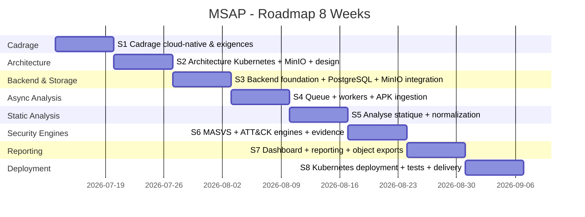

# Gantt 8 Weeks - MSAP

```mermaid
gantt
    title MSAP - Roadmap 8 Weeks
    dateFormat  YYYY-MM-DD
    section Cadrage
    S1 Cadrage cloud-native & exigences :s1, 2026-07-13, 7d
    section Architecture
    S2 Architecture Kubernetes + MinIO + design :s2, after s1, 7d
    section Backend & Storage
    S3 Backend foundation + PostgreSQL + MinIO integration :s3, after s2, 7d
    section Async Analysis
    S4 Queue + workers + APK ingestion :s4, after s3, 7d
    section Static Analysis
    S5 Analyse statique + normalization :s5, after s4, 7d
    section Security Engines
    S6 MASVS + ATT&CK engines + evidence :s6, after s5, 7d
    section Reporting
    S7 Dashboard + reporting + object exports :s7, after s6, 7d
    section Deployment
    S8 Kubernetes deployment + tests + delivery :s8, after s7, 7d
```

Docker Compose est limite au developpement local. Kubernetes, Helm, MinIO, PostgreSQL, Redis et workers sont les livrables structurants de la roadmap.
