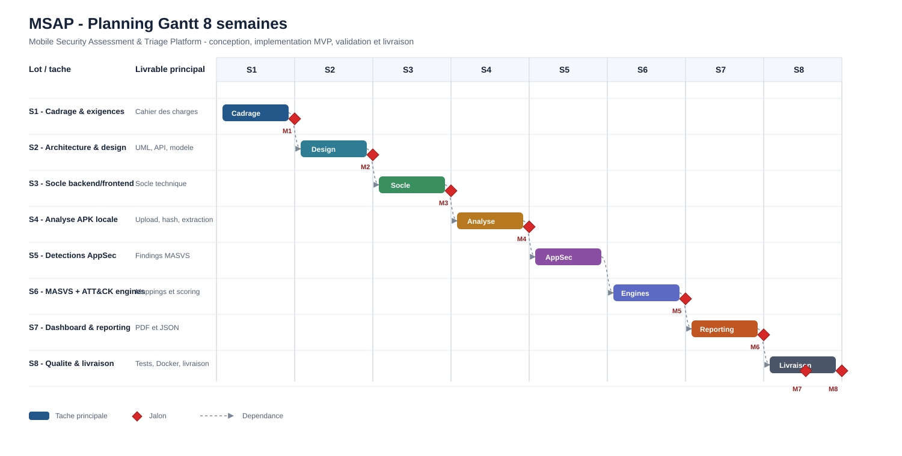

# Planning Gantt 8 Semaines - MSAP

## Vue synthetique

| Semaine | Theme | Dependances | Livrables | Milestone |
|---|---|---|---|---|
| S1 | Cadrage & exigences | Aucune | Cahier des charges, exigences | M1: Cadrage valide |
| S2 | Architecture & design | S1 | Architecture, UML, modele donnees, API | M2: Architecture validee |
| S3 | Socle backend/frontend | S2 | Socle technique local | M3: Socle technique operationnel |
| S4 | Analyse APK locale | S3 | Upload, hash, extraction, normalisation | M4: Analyse APK locale fonctionnelle |
| S5 | Detections AppSec | S4 | Regles MASVS, findings, preuves | - |
| S6 | MASVS + ATT&CK engines | S5 | Moteurs MASVS + ATT&CK, scoring | M5: Moteurs operationnels |
| S7 | Dashboard & reporting | S6 | Dashboard, PDF, JSON | M6: Rapport PDF genere |
| S8 | Qualite & livraison | S7 | Tests, Docker, documentation finale | M7: Version candidate / M8: Version livree |

## Diagramme Gantt

Le diagramme visuel est fourni au format SVG pour garantir un rendu lisible, stable et sans chevauchement, quel que soit le moteur Markdown utilise.

## Jalons

| Milestone | Description | Position |
|---|---|---|
| M1 | Cadrage valide | Fin S1 |
| M2 | Architecture validee | Fin S2 |
| M3 | Socle technique operationnel | Fin S3 |
| M4 | Analyse APK locale fonctionnelle | Fin S4 |
| M5 | Moteurs MASVS + ATT&CK operationnels | Fin S6 |
| M6 | Rapport PDF genere | Fin S7 |
| M7 | Version candidate | Debut fin S8 |
| M8 | Version livree | Fin S8 |
