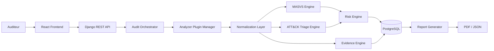

# Cahier des Charges - MSAP

## 1. Identification du Projet

**Nom du projet**: MSAP - Mobile Security Assessment & Triage Platform

**Sous-titre**: Plateforme locale d'evaluation de securite mobile et de triage d'APK basee sur OWASP MASVS et MITRE ATT&CK Mobile.

**Nature du projet**: Projet de fin d'annee / stage d'ingenierie cybersécurité.

**Version cible**: Version 1 - Analyse statique locale d'APK Android.

## 2. Contexte General

Les applications mobiles Android peuvent contenir des faiblesses de securite applicative, des configurations dangereuses, des secrets exposes ou des indicateurs techniques necessitant une revue analyste. Dans un contexte academique, institutionnel ou professionnel, l'analyse de ces APK doit etre realisee de maniere methodique, locale et documentee.

MSAP vise a fournir une plateforme locale permettant d'evaluer la securite applicative d'un APK selon OWASP MASVS et de realiser un triage initial d'indicateurs suspects selon MITRE ATT&CK Mobile.

## 3. Problematique

Les analyses APK sont souvent realisees avec des outils disperses, des scripts ponctuels ou des rapports manuels. Cette approche limite:

- la tracabilite des preuves;
- la reproductibilite de l'analyse;
- l'alignement avec des referentiels reconnus;
- la distinction entre faiblesse applicative et indicateur de menace;
- la protection de la confidentialite des APK analyses.

Le besoin est donc de concevoir une plateforme locale, structuree et extensible, capable de produire des resultats exploitables sans dependance a un service distant.

## 4. Objectif General

Concevoir et realiser un MVP local permettant l'ingestion, l'analyse statique, le triage, le scoring et le reporting d'APK Android autorises, dans une demarche d'ingenierie cybersécurité.

## 5. Objectifs Specifiques

- Importer et valider localement un APK.
- Calculer le hash SHA-256.
- Extraire les metadonnees principales de l'APK.
- Analyser le manifeste Android, les permissions et les composants.
- Extraire les ressources, chaines, URLs, IPs, domaines et secrets potentiels.
- Inspecter le code decompile lorsque cela est possible.
- Produire des findings AppSec mappes OWASP MASVS.
- Produire des indicateurs de triage mappes MITRE ATT&CK Mobile.
- Associer chaque resultat a une preuve technique.
- Calculer un score de risque et un score de conformite indicatif.
- Generer un rapport PDF et un export JSON.
- Deployer la solution localement via Docker Compose.

## 6. Perimetre Fonctionnel V1

| Domaine | Fonctionnalites attendues |
|---|---|
| Gestion | Gestion des projets et audits |
| Ingestion APK | Upload, validation, stockage local, hash SHA-256 |
| Analyse statique | Manifest, permissions, composants, signatures, ressources, chaines, code decompile si possible |
| AppSec | Detection de faiblesses applicatives et mapping OWASP MASVS |
| Triage menace | Detection d'indicateurs suspects et mapping MITRE ATT&CK Mobile |
| Preuves | Conservation des sources, extraits, chemins et niveaux de confiance |
| Scoring | Risk score, compliance score MASVS, triage score indicatif |
| Reporting | Rapport PDF, export JSON, synthese MASVS et ATT&CK |
| Deploiement | Execution locale via Docker Compose |

## 7. Hors Perimetre V1

- Dependances a MobSF.
- Frida.
- Android Emulator.
- Analyse dynamique.
- Sandbox malware.
- Verdict garanti malware/benin.
- Support iOS/IPA.
- Exploitation offensive ou tests intrusifs contre des systemes tiers.
- Services cloud ou API distantes.

## 8. Exigences Fonctionnelles

| ID | Exigence | Priorite |
|---|---|---|
| F-01 | L'utilisateur doit pouvoir creer un projet d'audit. | Haute |
| F-02 | L'utilisateur doit pouvoir creer un audit dans un projet. | Haute |
| F-03 | L'utilisateur doit pouvoir importer un APK localement. | Haute |
| F-04 | Le systeme doit valider le fichier APK avant analyse. | Haute |
| F-05 | Le systeme doit calculer le hash SHA-256. | Haute |
| F-06 | Le systeme doit extraire les metadonnees APK. | Haute |
| F-07 | Le systeme doit analyser `AndroidManifest.xml`. | Haute |
| F-08 | Le systeme doit extraire permissions et composants Android. | Haute |
| F-09 | Le systeme doit extraire ressources, chaines, URLs, IPs et domaines. | Haute |
| F-10 | Le systeme doit charger les regles MASVS depuis YAML. | Haute |
| F-11 | Le systeme doit charger les regles ATT&CK Mobile depuis YAML. | Haute |
| F-12 | Le systeme doit produire des findings AppSec. | Haute |
| F-13 | Le systeme doit produire des indicateurs de triage. | Haute |
| F-14 | Le systeme doit associer chaque resultat a une preuve. | Haute |
| F-15 | Le systeme doit calculer un score de risque. | Moyenne |
| F-16 | Le systeme doit calculer un score de conformite MASVS indicatif. | Moyenne |
| F-17 | Le systeme doit generer un rapport PDF. | Moyenne |
| F-18 | Le systeme doit generer un export JSON. | Moyenne |

## 9. Exigences Non Fonctionnelles

- La plateforme doit fonctionner localement.
- Les APK ne doivent pas etre transmis a des services distants.
- L'architecture doit etre modulaire et extensible.
- Les resultats doivent etre reproductibles.
- Les preuves doivent etre tracables.
- L'interface doit rester claire et orientee audit.
- Le deploiement doit etre compatible avec un poste institutionnel.
- Les choix techniques doivent rester realistes pour un PFA de deux mois.

## 10. Exigences de Securite

- Stockage local controle des APK.
- Controle d'acces aux projets et audits.
- Redaction ou masquage des secrets dans les preuves et rapports.
- Journalisation sans fuite de donnees sensibles.
- Confirmation d'usage autorise.
- Aucun verdict malware definitif base uniquement sur l'analyse statique.

## 11. Contraintes Techniques

- Backend prevu: Django REST Framework.
- Frontend prevu: React.
- Base de donnees locale: PostgreSQL.
- Deploiement: Docker Compose.
- Outils prevus: APKTool, JADX, Androguard, regex/YARA optionnel.
- Environnement cible: Ubuntu WSL ou Linux local.
- Contraintes ARM64 a prendre en compte lorsque possible.

## 12. Architecture Cible

## 13. Livrables Attendus

- Documentation de cadrage.
- Cahier des charges.
- Specification des exigences.
- Methodologie d'analyse MASVS + ATT&CK Mobile.
- Documents d'architecture et de design.
- Catalogues de regles YAML.
- MVP local.
- Tests de validation.
- Strategie de deploiement local.
- Rapport final et demonstration.

## 14. Criteres d'Acceptation

- Le projet reste local-first.
- Les APK sont importes, valides et hashes.
- Les regles MASVS et ATT&CK sont chargees depuis YAML.
- Les findings et indicateurs contiennent preuves, severite et confiance.
- Le rapport distingue clairement audit AppSec et triage menace.
- Le rapport ne presente pas de verdict malware garanti.
- La solution est deployable localement.

## 15. Risques et Mesures de Mitigation

| Risque | Impact | Mitigation |
|---|---|---|
| Faux positifs | Mauvaise interpretation | Niveau de confiance et revue analyste |
| Limites de l'analyse statique | Resultats incomplets | Documentation explicite des limites |
| Complexite des outils Android | Retard MVP | Architecture plugin et priorisation |
| Donnees sensibles dans APK | Fuite d'information | Stockage local et redaction |
| Confusion triage/verdict | Mauvais usage | Wording prudent et disclaimer |

## 16. Planning Synthétique

| Semaine | Objectif |
|---|---|
| S1 | Cadrage & exigences |
| S2 | Architecture & design |
| S3 | Socle backend/frontend |
| S4 | Analyse APK locale |
| S5 | Detections AppSec |
| S6 | MASVS + ATT&CK engines |
| S7 | Dashboard & reporting |
| S8 | Qualite & livraison |

## 17. Conclusion

Ce cahier des charges formalise le besoin, le perimetre, les contraintes et les criteres d'acceptation de MSAP V1. Il positionne le projet comme une plateforme d'ingenierie cybersécurité locale, centree sur l'analyse statique Android, l'evaluation OWASP MASVS, le triage MITRE ATT&CK Mobile et la production de preuves exploitables.
