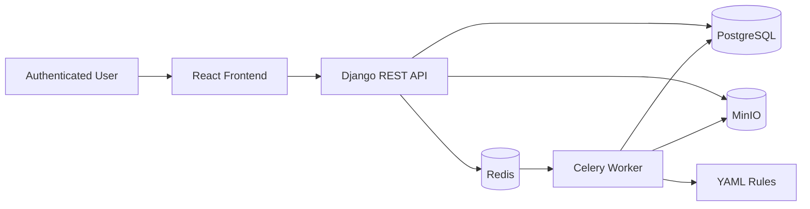

# Architecture - MSAP

## Overview
MSAP is a cloud-native web application with an API, asynchronous workers, metadata storage and object storage.

## Component Boundaries
| Component | Responsibility | Must not do |
|---|---|---|
| Django API | Authenticated workflows, uploads, status, findings, exports | Heavy APK analysis inline or raw APK storage in PostgreSQL |
| PostgreSQL | Metadata, relationships, status, scores, object references | Store raw APK payloads or large binary reports |
| MinIO | Private object storage for APKs, artifacts, evidence, reports and exports | Host the application or enforce business authorization alone |
| Redis/Celery | Queue and asynchronous analysis execution | Expose public endpoints |
| Worker | Analyzer execution, normalization, rule evaluation, evidence generation | Trust APK input or produce malware verdicts |
| Rules | YAML MASVS and ATT&CK detection definitions | Replace analyst judgement |
| Report generator | On-demand deterministic JSON and PDF reports | Bypass redaction or rerun analysis |
| Session/RBAC layer | Django sessions, CSRF, group roles and login protection | Store browser bearer tokens or expose registration |
| Status service | Bounded cached dependency and capability checks | Expose credentials, raw exceptions or sensitive hostnames |

## Data Flow
1. User creates an audit and uploads an APK.
2. Backend stores the APK in MinIO.
3. Backend creates PostgreSQL metadata and an `ObjectStorageReference`.
4. Backend enqueues a Celery analysis task.
5. Worker reads the APK through the storage reference.
6. Worker creates raw outputs, normalized artifacts, findings, indicators and evidence.
7. Backend exposes audit status and results.
8. Report generator creates JSON export objects in MinIO.

The React application polls component status every five seconds only while the
page is visible. The aggregate is cached for roughly five seconds. This keeps
the platform operationally useful without WebSockets or a service mesh.

## Kubernetes Target
Production packaging should include:
- Frontend deployment and service.
- Backend deployment and service.
- Worker deployment.
- Redis.
- PostgreSQL.
- MinIO.
- Ingress with TLS.
- ConfigMaps and Secrets.
- Persistent volumes for stateful services.
- Network policies for production.

Docker Compose remains development-only.

## Analysis boundary

APK ZIP validation and checksum verification happen before bounded static
inspection. Workers never execute APK code or allow APK-originated network
activity. Large outputs belong in MinIO; PostgreSQL stores normalized bounded
matches and object references. Optional external-tool capabilities are reported
and skipped when absent.
