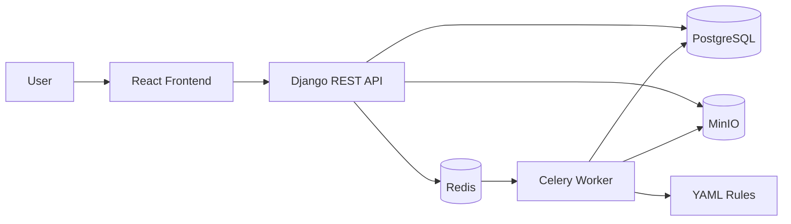

# Architecture - MSAP

## Overview
MSAP is a cloud-native web application with an API, asynchronous workers, metadata storage and object storage.

## Component Boundaries
| Component | Responsibility | Must not do |
|---|---|---|
| Django API | Authenticated workflows, uploads, status, findings, exports | Heavy APK analysis inline or raw APK storage in PostgreSQL |
| PostgreSQL | Metadata, relationships, status, scores, object references | Store raw APK payloads or large binary reports |
| MinIO | Private object storage for APKs, artifacts, evidence, reports and exports | Host the application or enforce business authorization alone |
| Redis/Celery | Queue and asynchronous analysis execution | Expose public endpoints |
| Worker | Analyzer execution, normalization, rule evaluation, evidence generation | Trust APK input or produce malware verdicts |
| Rules | YAML MASVS and ATT&CK detection definitions | Replace analyst judgement |
| Report generator | JSON exports and later PDF reports | Bypass redaction or rerun analysis |

## Data Flow
1. User creates an audit and uploads an APK.
2. Backend stores the APK in MinIO.
3. Backend creates PostgreSQL metadata and an `ObjectStorageReference`.
4. Backend enqueues a Celery analysis task.
5. Worker reads the APK through the storage reference.
6. Worker creates raw outputs, normalized artifacts, findings, indicators and evidence.
7. Backend exposes audit status and results.
8. Report generator creates JSON export objects in MinIO.

## Kubernetes Target
Production packaging should include:
- Frontend deployment and service.
- Backend deployment and service.
- Worker deployment.
- Redis.
- PostgreSQL.
- MinIO.
- Ingress with TLS.
- ConfigMaps and Secrets.
- Persistent volumes for stateful services.
- Network policies for production.

Docker Compose remains development-only.

## Optional AI Boundary
Kimi AI is outside V1.0. If enabled later, it receives only redacted post-analysis context and returns advisory text that requires analyst validation.

