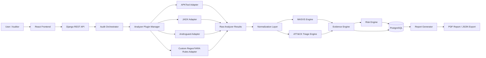

# Software Architecture Document - MSAP

## Architecture Goals

- Fournir une plateforme locale d'evaluation de securite mobile et de triage d'APK.
- Combiner OWASP MASVS pour l'AppSec et MITRE ATT&CK Mobile pour le triage menace.
- Maintenir une architecture extensible par plugins d'analyse.
- Normaliser les resultats bruts avant mapping, scoring et reporting.
- Proteger la confidentialite des APK et artefacts analyses.

## Security Engineering Principles

- **Local-first**: aucun APK ni artefact n'est transmis a un service distant.
- **Evidence-based**: chaque finding ou indicateur doit etre relie a une preuve.
- **Separation of concerns**: ingestion, analyse, normalisation, mapping, scoring et reporting sont separes.
- **Cautious triage**: ATT&CK Mobile sert au triage, pas a un verdict malware.
- **Extensibility**: les adaptateurs peuvent evoluer sans casser les moteurs metier.

## Local-First Architecture

MSAP est deploye sur poste institutionnel via Docker Compose. Les APK, artefacts extraits, preuves, rapports PDF et exports JSON restent stockes localement.

## Plugin-Based Analyzer Architecture

Le gestionnaire de plugins orchestre plusieurs adaptateurs:

- APKTool Adapter pour manifeste et ressources.
- JADX Adapter pour code decompile.
- Androguard Adapter pour metadonnees et inspections Python.
- Custom Regex/YARA Rules Adapter pour motifs et indicateurs.

## Normalization Layer

La couche de normalisation transforme les resultats bruts en artefacts internes: manifest attributes, permissions, components, strings, URLs, domains, IPs, code patterns, certificates et signatures. Les moteurs MASVS et ATT&CK consomment ce schema commun.

## MASVS Engine

Le moteur MASVS charge `rules/masvs_static_rules.yaml`, execute les regles AppSec et produit des findings lies aux categories OWASP MASVS.

## ATT&CK Triage Engine

Le moteur ATT&CK charge `rules/attck_mobile_triage_rules.yaml`, detecte des indicateurs suspects et mappe ces signaux vers des tactiques et techniques MITRE ATT&CK Mobile. Il ne produit pas de verdict malveillant.

## Risk Engine

Le moteur de risque combine severite, confiance, impact, exposition et exploitabilite. Il produit un score global et des scores par finding ou indicateur.

## Evidence Engine

Le moteur de preuves garantit la tracabilite: artefact APK -> regle -> finding/indicateur -> mapping standard -> score -> rapport.

## Reporting Engine

Le generateur de rapports produit un PDF et un export JSON contenant le perimetre, la methodologie, les limites, les findings MASVS, les indicateurs ATT&CK, les preuves, les scores et les recommandations.

## Database

PostgreSQL stocke les projets, audits, APK, metadonnees, resultats bruts references, artefacts normalises, findings, indicateurs, preuves, scores et rapports.

## Local Deployment

Docker Compose regroupe le frontend React, l'API Django REST, PostgreSQL et les volumes locaux. Les outils Android sont installes localement dans l'environnement d'analyse.

## Security Architecture

- Validation des fichiers uploades.
- Repertoires locaux controles.
- Redaction des secrets dans logs et rapports.
- Authentification locale.
- Controle d'acces par projet/audit.
- Journalisation sans fuite de donnees sensibles.

## Confidentiality of Uploaded APKs

Les APK peuvent etre sensibles ou proprietaires. MSAP doit eviter tout envoi reseau, conserver les fichiers dans des volumes locaux et documenter les pratiques de suppression, sauvegarde et acces.

## Extensibility

L'architecture permet d'ajouter plus tard analyse dynamique, iOS, integrations externes ou enrichissement YARA. Ces extensions restent hors perimetre V1.

## Architecture Diagram

