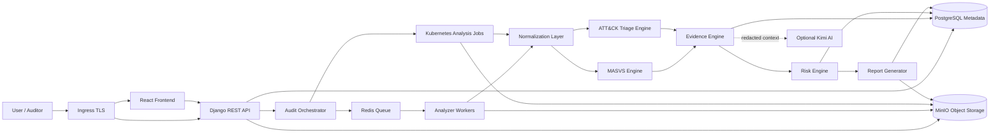

# Software Architecture Document - MSAP Cloud

## Architecture goals
- Fournir une plateforme cloud-native d'evaluation de securite mobile et de triage d'APK.
- Combiner OWASP MASVS pour l'AppSec et MITRE ATT&CK Mobile pour le triage prudent.
- Maintenir une architecture extensible par analyseurs.
- Normaliser les resultats avant mapping, scoring, evidence et reporting.
- Proteger APK et artefacts via MinIO, PostgreSQL, Kubernetes Secrets, RBAC et TLS.

## Security engineering principles
- **Cloud-native self-hostable**: Kubernetes est la cible de deploiement.
- **Evidence-based**: chaque finding ou indicateur doit etre relie a une preuve.
- **Separation of concerns**: ingestion, queue, analyse, normalisation, mapping, scoring, storage et reporting sont separes.
- **Cautious triage**: ATT&CK Mobile sert au triage, pas a un verdict malware.
- **Controlled object storage**: MinIO stocke les objets; PostgreSQL stocke les metadonnees.

## Logical architecture
Ingress TLS expose React Frontend et Django REST API. L'API gere projets, audits, uploads, references MinIO et statuts. L'Audit Orchestrator place les analyses dans Redis. Les workers ou Kubernetes Jobs recuperent les APK depuis MinIO, produisent artefacts, normalisent les resultats, alimentent les moteurs MASVS/ATT&CK, l'Evidence Engine et le Risk Engine. Les rapports sont stockes dans MinIO et references en PostgreSQL.

## Infrastructure components
- Kubernetes namespace `msap`.
- Deployments frontend, backend API et workers.
- Redis queue.
- PostgreSQL metadata database.
- MinIO object storage.
- Ingress HTTPS.
- Kubernetes Secrets et ConfigMaps.
- NetworkPolicies, ServiceAccounts, PVC et Helm chart.

## Optional AI Assistant Layer
Kimi AI reste optionnel, desactive par defaut et post-analyse uniquement. Il recoit un contexte minimal redige; jamais d'APK brut, de source decompilee complete ou de secret non masque. Les sorties sont validees par analyste.

## Architecture Diagram

