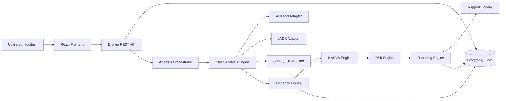

# Software Architecture Document - MSAP

## Objectifs d'architecture

- Fournir une plateforme locale d'audit statique Android.
- Separer clairement l'interface, l'API, l'orchestration, les moteurs d'analyse et le reporting.
- Faciliter l'ajout futur de nouveaux analyseurs sans modifier le coeur applicatif.
- Garantir la tracabilite des preuves et des decisions de scoring.
- Rester realiste pour un projet PFA de 8 semaines.

## Principes architecturaux

- **Local-first**: aucun transfert d'APK ou de resultat vers un service distant.
- **Modularite**: chaque moteur possede une responsabilite claire.
- **Traçabilite**: chaque finding doit etre relie a une preuve.
- **Extensibilite controlee**: les integrations futures sont prevues par adaptateurs, sans etre incluses dans la Version 1.
- **Separation des preoccupations**: detection, mapping MASVS, scoring et reporting sont separes.

## Architecture modulaire

MSAP est structure autour d'un backend central qui orchestre les analyses locales. Le frontend sert a piloter les audits et consulter les resultats. Les moteurs d'analyse produisent des findings normalises, enrichis par les moteurs MASVS, risque et preuves.

## Composants principaux

### Frontend

Interface utilisateur prevue pour la gestion des audits, l'import d'APK, la consultation des resultats, le tableau de bord et le telechargement des rapports.

### Backend API

API locale chargee de recevoir les demandes du frontend, gerer les audits, stocker les metadonnees et exposer les resultats. Le choix prevu est Django REST Framework.

### Analysis Orchestrator

Composant responsable de coordonner les etapes d'analyse: preparation du fichier, extraction des artefacts, execution des regles, consolidation des findings et generation des rapports.

### Static Analysis Engine

Moteur dedie a l'analyse statique Android. Il traite le manifeste, les ressources, le code decompile et les configurations.

### MASVS Engine

Composant qui associe les findings aux categories OWASP MASVS et applique le catalogue de regles MSAP.

### Risk Engine

Composant qui calcule une severite et un score de risque a partir de la regle, du contexte, de la confiance et de l'impact.

### Evidence Engine

Composant responsable de normaliser et conserver les preuves techniques: fichier, ligne si disponible, extrait, artefact source et contexte.

### Reporting Engine

Composant qui genere un rapport local contenant la synthese, le perimetre, les limites, les findings, les preuves et les recommandations.

### Database

Base locale prevue pour stocker les audits, APK references, findings, preuves, scores et rapports. PostgreSQL est prevu pour un deploiement local structure.

## Architecture de deploiement local

La Version 1 est concue pour une execution locale. Un deploiement Docker local pourra regrouper le frontend, le backend, la base PostgreSQL et les analyseurs. Aucun composant ne doit necessiter un service cloud.

## Architecture de securite

- Isolation logique des fichiers APK importes.
- Validation des fichiers et chemins.
- Stockage local des preuves.
- Journalisation technique sans fuite de secrets.
- Controle du perimetre d'analyse.
- Documentation explicite de l'usage autorise uniquement.

## Extensibilite future

L'architecture prevoit des adaptateurs pour integrer ulterieurement:

- MobSF comme outil optionnel externe.
- Frida pour instrumentation dynamique autorisee.
- Analyse dynamique sur terminal physique.
- Analyse iOS.
- Nouveaux packs de regles MASVS.

Ces integrations restent hors perimetre de la Version 1.

## Diagramme d'architecture

