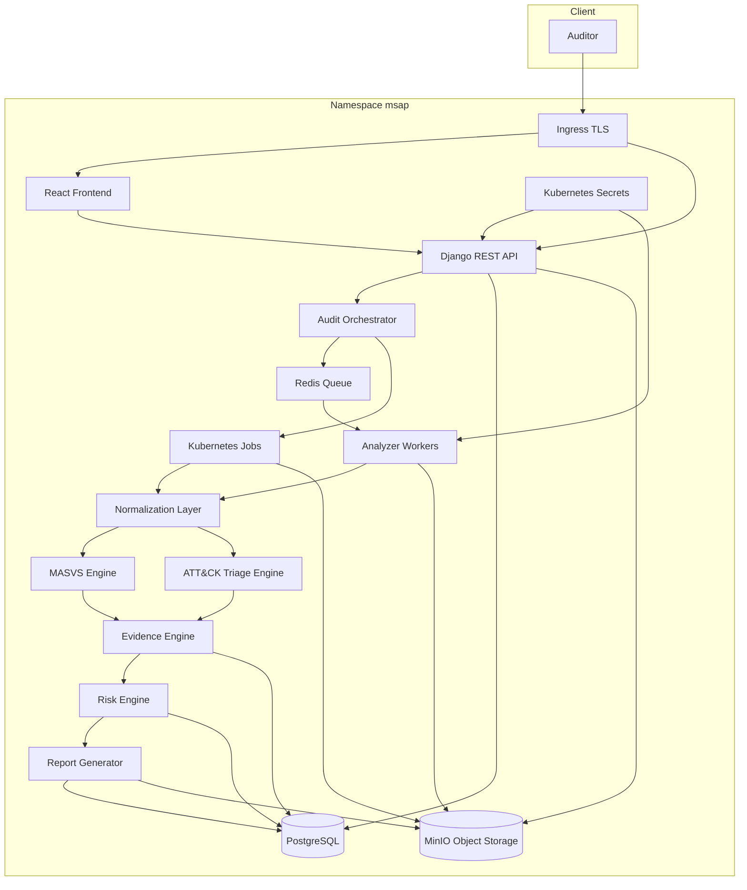

# Component Diagram - MSAP

## Notes
MinIO est un stockage objet pour APK, artefacts, preuves, rapports et exports. Kubernetes est la cible de deploiement. Docker Compose est reserve au developpement local.
