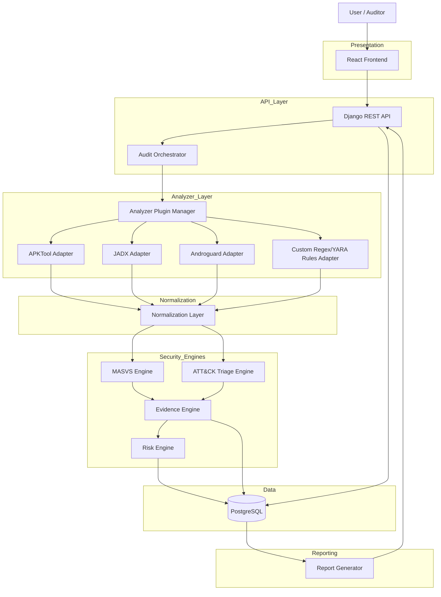

# Component Diagram - MSAP

```mermaid
flowchart TB
    Auditor[User / Auditor]

    subgraph Presentation
        FE[React Frontend]
    end

    subgraph API_Layer
        API[Django REST API]
        ORCH[Audit Orchestrator]
    end

    subgraph Analyzer_Layer
        PM[Analyzer Plugin Manager]
        APK[APKTool Adapter]
        JADX[JADX Adapter]
        AG[Androguard Adapter]
        RY[Custom Regex/YARA Rules Adapter]
    end

    subgraph Normalization
        NORM[Normalization Layer]
    end

    subgraph Security_Engines
        MASVS[MASVS Engine]
        ATTCK[ATT&CK Triage Engine]
        EVID[Evidence Engine]
        RISK[Risk Engine]
    end

    subgraph Data
        DB[(PostgreSQL)]
    end

    subgraph Reporting
        REPORT[Report Generator]
    end

    Auditor --> FE
    FE --> API
    API --> ORCH
    ORCH --> PM
    PM --> APK
    PM --> JADX
    PM --> AG
    PM --> RY
    APK --> NORM
    JADX --> NORM
    AG --> NORM
    RY --> NORM
    NORM --> MASVS
    NORM --> ATTCK
    MASVS --> EVID
    ATTCK --> EVID
    EVID --> RISK
    RISK --> DB
    EVID --> DB
    API --> DB
    DB --> REPORT
    REPORT --> API
```
