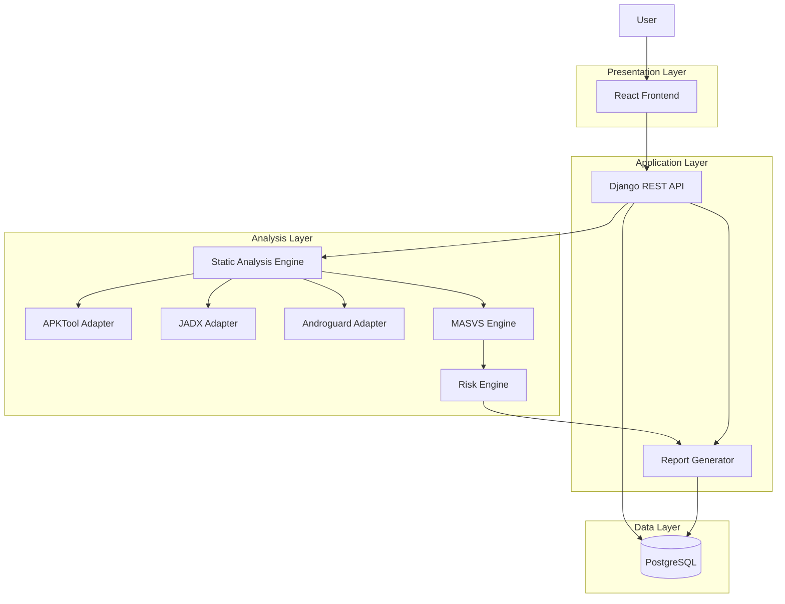

# Component Diagram - MSAP

```mermaid
flowchart TB
    User[User]

    subgraph UI[Presentation Layer]
        React[React Frontend]
    end

    subgraph Backend[Application Layer]
        API[Django REST API]
        Report[Report Generator]
    end

    subgraph Analysis[Analysis Layer]
        Static[Static Analysis Engine]
        APKTool[APKTool Adapter]
        JADX[JADX Adapter]
        Androguard[Androguard Adapter]
        MASVS[MASVS Engine]
        Risk[Risk Engine]
    end

    subgraph Data[Data Layer]
        DB[(PostgreSQL)]
    end

    User --> React
    React --> API
    API --> DB
    API --> Static
    Static --> APKTool
    Static --> JADX
    Static --> Androguard
    Static --> MASVS
    MASVS --> Risk
    Risk --> Report
    Report --> DB
    API --> Report
```
