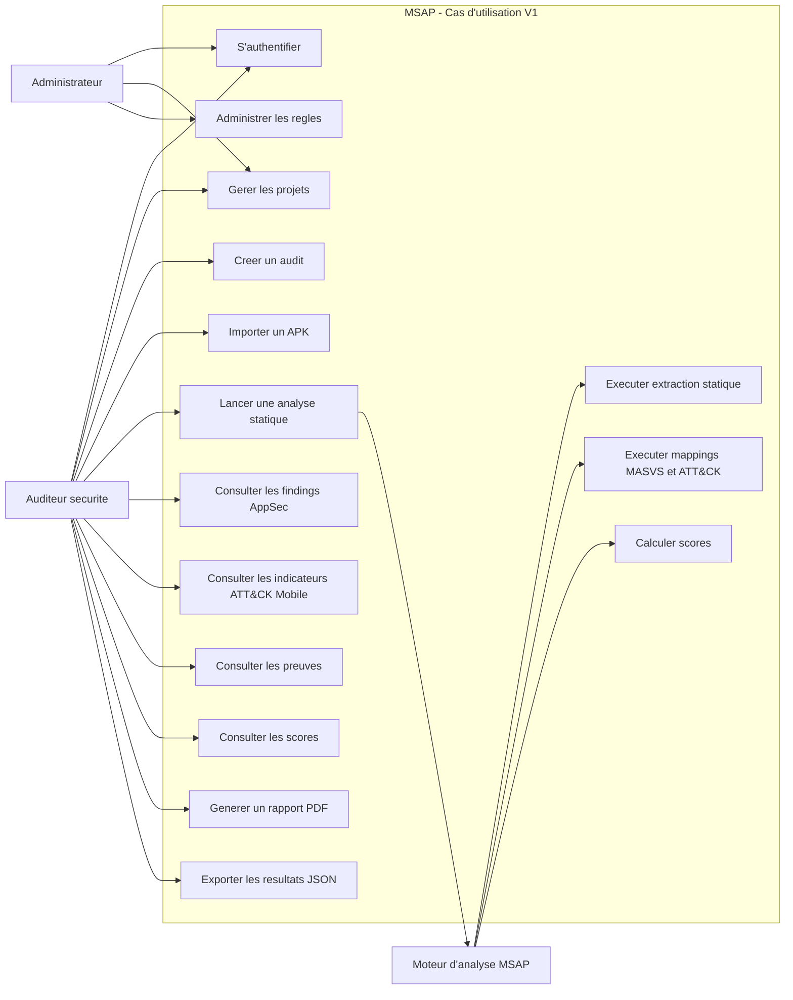

# Diagramme UML des Cas d'Utilisation - MSAP

## Vue d'ensemble

Cette vue presente les interactions principales entre les acteurs et la plateforme MSAP. Elle reste volontairement simple afin de clarifier le perimetre fonctionnel de la Version 1: analyse statique locale d'APK Android, evaluation OWASP MASVS, triage MITRE ATT&CK Mobile, preuves, scoring et reporting.

## Acteurs

- **Auditeur securite**: utilisateur principal qui cree les audits, importe les APK et consulte les resultats.
- **Administrateur**: gere les utilisateurs, les projets et les catalogues de regles.
- **Moteur d'analyse MSAP**: composant systeme qui execute le pipeline d'analyse, la normalisation, les mappings et le scoring.

## Cas d'utilisation principaux

- S'authentifier.
- Gerer les projets.
- Creer un audit.
- Importer un APK.
- Lancer une analyse statique.
- Consulter les findings AppSec.
- Consulter les indicateurs de triage ATT&CK Mobile.
- Consulter les preuves.
- Consulter les scores.
- Generer un rapport PDF.
- Exporter les resultats JSON.
- Administrer les regles.

## Diagramme

