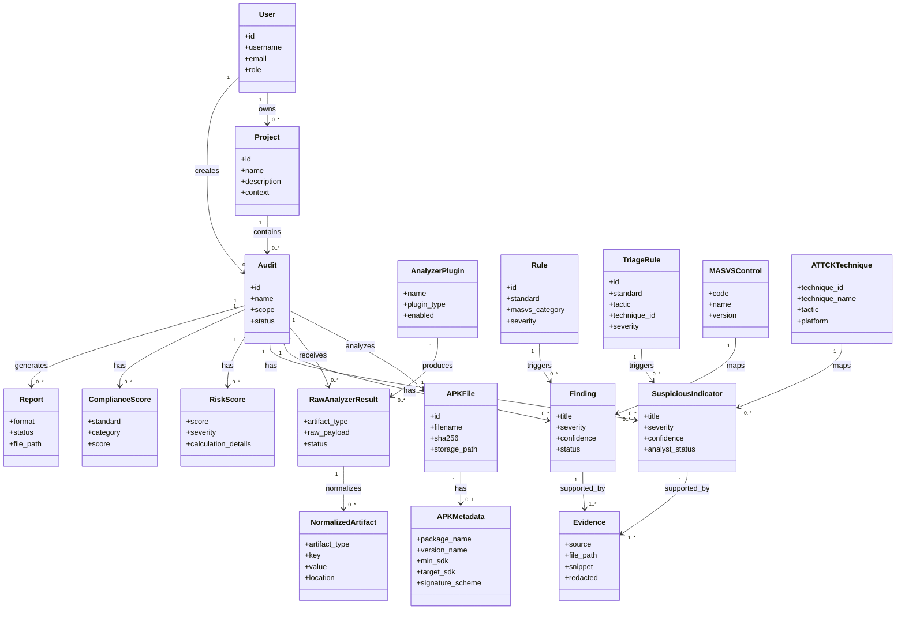

# Diagramme UML de Classes - MSAP

## Objectif

Ce diagramme represente une vue simplifiee des classes et entites du domaine MSAP. Il ne decrit pas tous les attributs d'implementation Django, mais clarifie les relations metier entre projets, audits, APK, artefacts, regles, findings, indicateurs, preuves, scores et rapports.

## Diagramme

