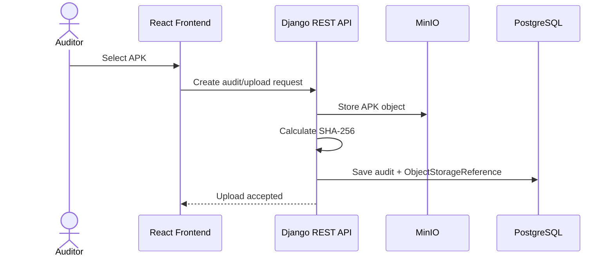
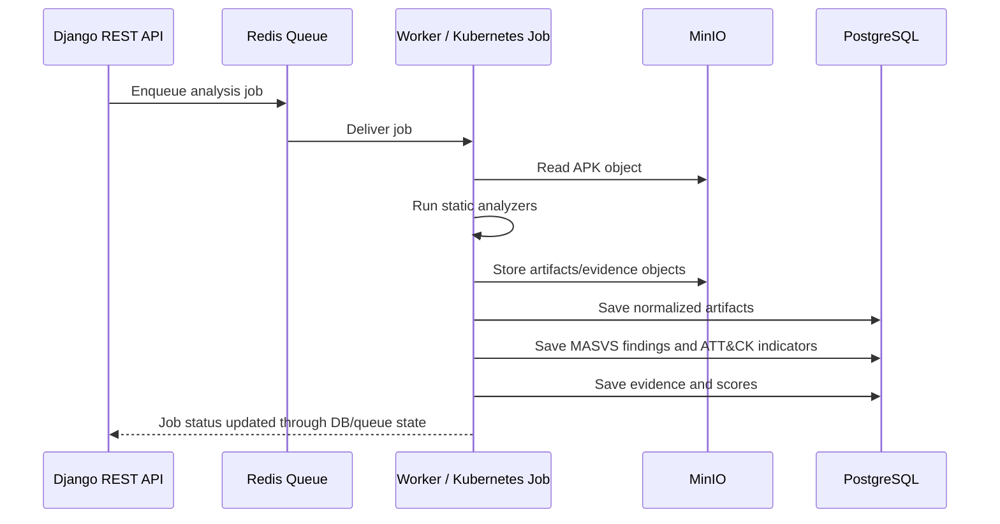
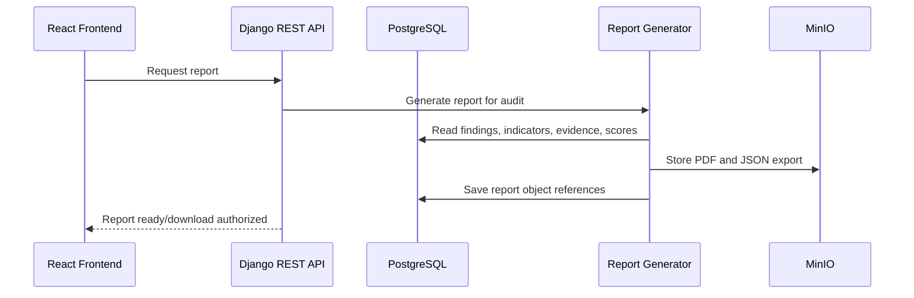

# UML Sequence Diagrams - MSAP

## Upload APK

```mermaid
sequenceDiagram
    actor Auditor
    participant FE as React Frontend
    participant API as Django REST API
    participant S3 as MinIO
    participant DB as PostgreSQL
    Auditor->>FE: Select APK
    FE->>API: Create audit/upload request
    API->>S3: Store APK object
    API->>API: Calculate SHA-256
    API->>DB: Save audit + ObjectStorageReference
    API-->>FE: Upload accepted
```

## Asynchronous analysis

```mermaid
sequenceDiagram
    participant API as Django REST API
    participant Q as Redis Queue
    participant W as Worker / Kubernetes Job
    participant S3 as MinIO
    participant DB as PostgreSQL
    API->>Q: Enqueue analysis job
    Q->>W: Deliver job
    W->>S3: Read APK object
    W->>W: Run static analyzers
    W->>S3: Store artifacts/evidence objects
    W->>DB: Save normalized artifacts
    W->>DB: Save MASVS findings and ATT&CK indicators
    W->>DB: Save evidence and scores
    W-->>API: Job status updated through DB/queue state
```

## Reporting

```mermaid
sequenceDiagram
    participant FE as React Frontend
    participant API as Django REST API
    participant DB as PostgreSQL
    participant R as Report Generator
    participant S3 as MinIO
    FE->>API: Request report
    API->>R: Generate report for audit
    R->>DB: Read findings, indicators, evidence, scores
    R->>S3: Store PDF and JSON export
    R->>DB: Save report object references
    API-->>FE: Report ready/download authorized
```
