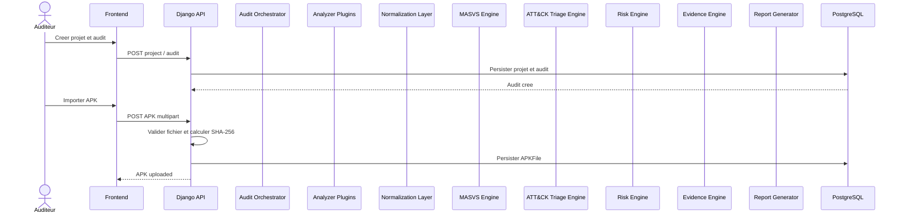
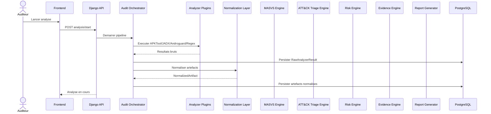
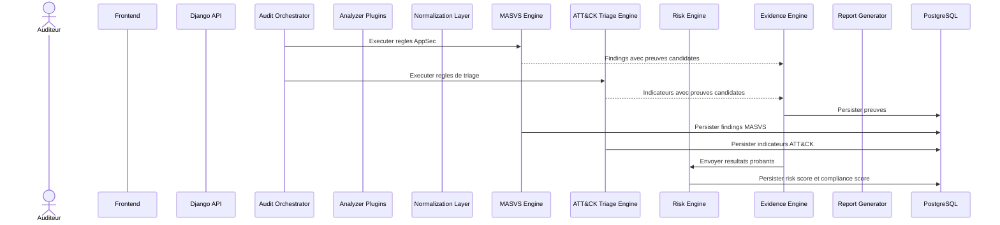
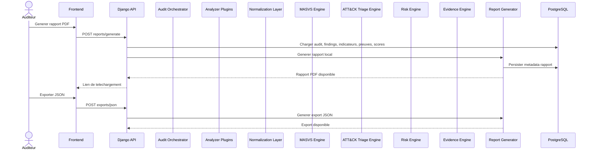

# Diagrammes UML de Sequence - MSAP

## A. Creation d'audit et upload APK

```mermaid
sequenceDiagram
    actor U as Auditeur
    participant FE as Frontend
    participant API as Django API
    participant ORCH as Audit Orchestrator
    participant PLUG as Analyzer Plugins
    participant NORM as Normalization Layer
    participant MASVS as MASVS Engine
    participant ATTCK as ATT&CK Triage Engine
    participant RISK as Risk Engine
    participant EVID as Evidence Engine
    participant REP as Report Generator
    participant DB as PostgreSQL

    U->>FE: Creer projet et audit
    FE->>API: POST project / audit
    API->>DB: Persister projet et audit
    DB-->>API: Audit cree
    U->>FE: Importer APK
    FE->>API: POST APK multipart
    API->>API: Valider fichier et calculer SHA-256
    API->>DB: Persister APKFile
    API-->>FE: APK uploaded
```

## B. Execution de l'analyse statique

```mermaid
sequenceDiagram
    actor U as Auditeur
    participant FE as Frontend
    participant API as Django API
    participant ORCH as Audit Orchestrator
    participant PLUG as Analyzer Plugins
    participant NORM as Normalization Layer
    participant MASVS as MASVS Engine
    participant ATTCK as ATT&CK Triage Engine
    participant RISK as Risk Engine
    participant EVID as Evidence Engine
    participant REP as Report Generator
    participant DB as PostgreSQL

    U->>FE: Lancer analyse
    FE->>API: POST analysis/start
    API->>ORCH: Demarrer pipeline
    ORCH->>PLUG: Executer APKTool/JADX/Androguard/Regex
    PLUG-->>ORCH: Resultats bruts
    ORCH->>DB: Persister RawAnalyzerResult
    ORCH->>NORM: Normaliser artefacts
    NORM-->>ORCH: NormalizedArtifact
    ORCH->>DB: Persister artefacts normalises
    API-->>FE: Analyse en cours
```

## C. Mapping MASVS et ATT&CK Mobile

```mermaid
sequenceDiagram
    actor U as Auditeur
    participant FE as Frontend
    participant API as Django API
    participant ORCH as Audit Orchestrator
    participant PLUG as Analyzer Plugins
    participant NORM as Normalization Layer
    participant MASVS as MASVS Engine
    participant ATTCK as ATT&CK Triage Engine
    participant RISK as Risk Engine
    participant EVID as Evidence Engine
    participant REP as Report Generator
    participant DB as PostgreSQL

    ORCH->>MASVS: Executer regles AppSec
    MASVS-->>EVID: Findings avec preuves candidates
    ORCH->>ATTCK: Executer regles de triage
    ATTCK-->>EVID: Indicateurs avec preuves candidates
    EVID->>DB: Persister preuves
    MASVS->>DB: Persister findings MASVS
    ATTCK->>DB: Persister indicateurs ATT&CK
    EVID->>RISK: Envoyer resultats probants
    RISK->>DB: Persister risk score et compliance score
```

## D. Generation de rapport

```mermaid
sequenceDiagram
    actor U as Auditeur
    participant FE as Frontend
    participant API as Django API
    participant ORCH as Audit Orchestrator
    participant PLUG as Analyzer Plugins
    participant NORM as Normalization Layer
    participant MASVS as MASVS Engine
    participant ATTCK as ATT&CK Triage Engine
    participant RISK as Risk Engine
    participant EVID as Evidence Engine
    participant REP as Report Generator
    participant DB as PostgreSQL

    U->>FE: Generer rapport PDF
    FE->>API: POST reports/generate
    API->>DB: Charger audit, findings, indicateurs, preuves, scores
    API->>REP: Generer rapport local
    REP->>DB: Persister metadata rapport
    REP-->>API: Rapport PDF disponible
    API-->>FE: Lien de telechargement
    U->>FE: Exporter JSON
    FE->>API: POST exports/json
    API->>REP: Generer export JSON
    REP-->>API: Export disponible
```
