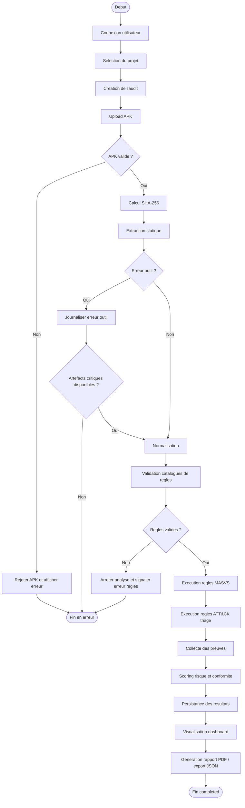

# Diagramme UML d'Activite - Workflow APK MSAP

## Objectif

Ce diagramme decrit le workflow complet d'evaluation statique et de triage d'un APK Android dans MSAP V1, avec les principaux chemins d'erreur.

