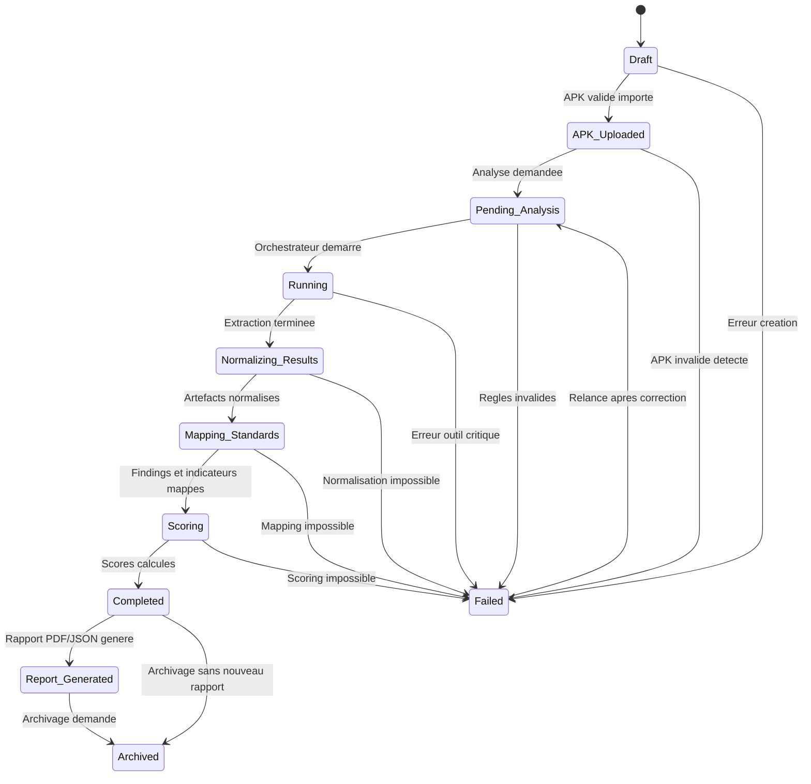

# Diagramme UML d'Etat - Cycle de Vie d'un Audit

## Objectif

Ce diagramme represente les etats principaux d'un audit MSAP, depuis sa creation jusqu'a son archivage.

## Logique de transition

- Un audit commence en `Draft`.
- Apres upload et validation de l'APK, il passe a `APK Uploaded`.
- Le lancement de l'analyse le place en `Pending Analysis`, puis `Running`.
- Le pipeline progresse vers normalisation, mapping, scoring, puis completion.
- Toute erreur bloquante conduit a `Failed`.
- Un rapport peut etre genere apres completion.
- Un audit termine peut etre archive.

