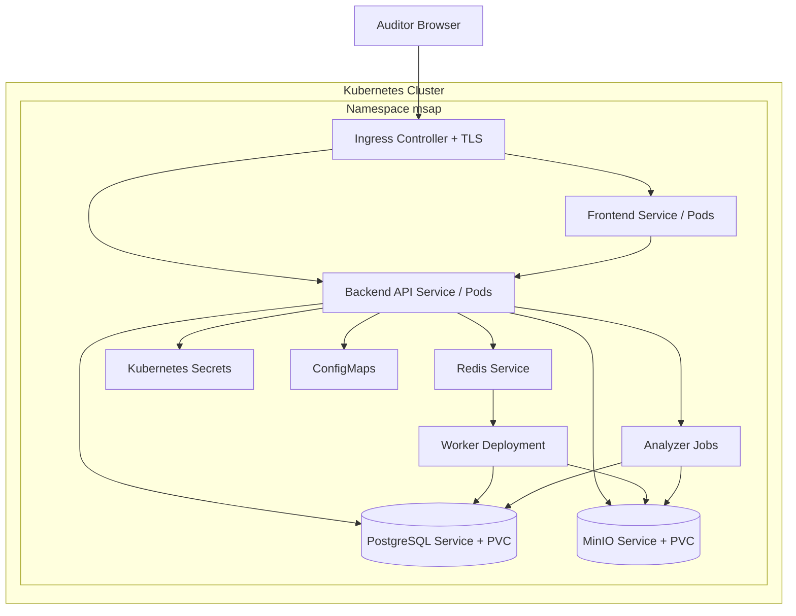

# Deployment Diagram - MSAP

Kubernetes est la cible de deploiement. Docker Compose existe seulement pour le developpement local.

```mermaid
flowchart TB
    U[Auditor Browser] --> TLS[Ingress Controller + TLS]
    subgraph CLUSTER[Kubernetes Cluster]
      subgraph NS[Namespace msap]
        TLS --> FE[Frontend Service / Pods]
        TLS --> API[Backend API Service / Pods]
        FE --> API
        API --> REDIS[Redis Service]
        REDIS --> WORKER[Worker Deployment]
        API --> JOB[Analyzer Jobs]
        API --> PG[(PostgreSQL Service + PVC)]
        API --> MINIO[(MinIO Service + PVC)]
        WORKER --> PG
        WORKER --> MINIO
        JOB --> PG
        JOB --> MINIO
        API --> SEC[Kubernetes Secrets]
        API --> CM[ConfigMaps]
      end
    end
```
