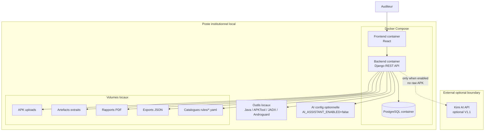

# Diagramme de Deploiement Local - MSAP

## Objectif

MSAP V1 cible un deploiement local sur poste institutionnel via Docker Compose. Aucun service distant n'est requis pour l'analyse, le stockage, le reporting ou le triage.

## Contraintes

- Local-first.
- ARM64-friendly lorsque possible.
- Volumes locaux pour APK, artefacts, rapports et exports.
- Catalogues de regles locaux.
- Pas de dependance MobSF, emulateur ou analyse dynamique.
- Kimi AI optionnel, desactive par defaut et appele uniquement avec contexte redige.

## Notes de deploiement

Les images Docker et outils doivent etre testes sur l'environnement cible. Si un outil n'est pas disponible en ARM64, il doit etre documente comme optionnel ou remplace par une alternative compatible.

L'appel Kimi AI est hors du noyau local V1. Il est autorise uniquement si l'institution l'approuve, si la configuration l'active explicitement et si la redaction empeche l'envoi d'APK brut, de source complete ou de secrets.
