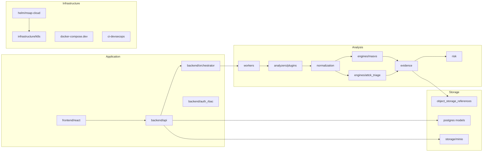

# Package / Module Diagram - MSAP Cloud

## Modules ajoutes
`infrastructure/k8s`, `helm/msap-cloud`, `storage/minio`, `object_storage_references`, `workers` et `ci-devsecops` deviennent des modules de conception.
