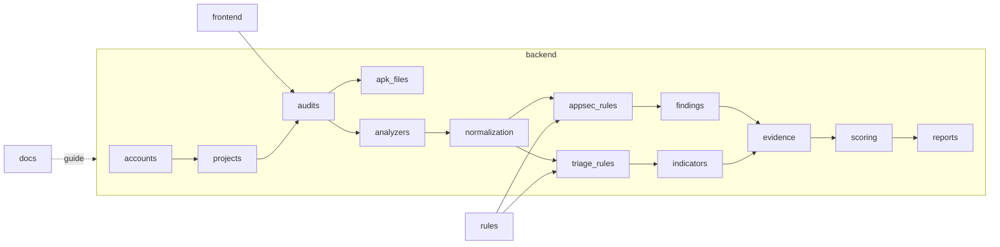

# Diagramme des Packages et Modules - MSAP

## Objectif

Ce diagramme presente l'organisation logique cible du projet. Les modules sont separes pour maintenir un couplage faible entre interface, API, ingestion APK, analyse, normalisation, regles, preuves, scoring et reporting.

## Principes de dependance

- `frontend` consomme uniquement l'API.
- `analyzers` produit des resultats bruts, sans logique MASVS/ATT&CK.
- `normalization` isole les moteurs de regles des formats outils.
- `appsec_rules` et `triage_rules` restent separes.
- `evidence` centralise la preuve pour findings et indicateurs.
- `reports` lit les resultats persistés et ne relance pas l'analyse.
