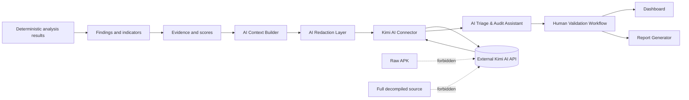
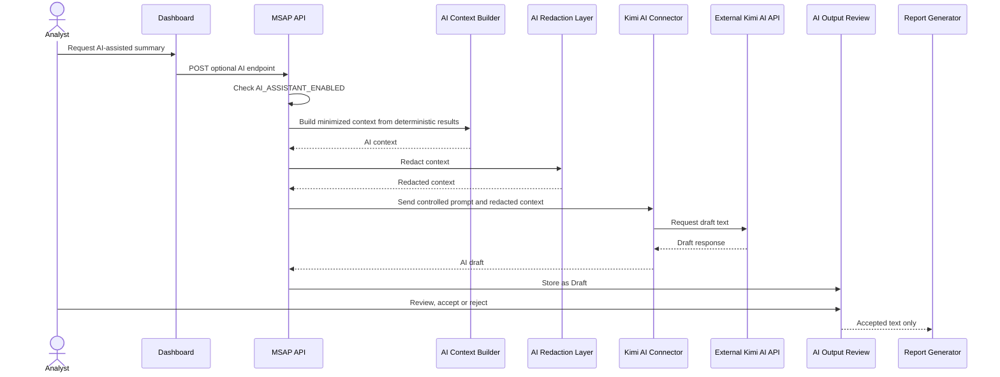

# AI Assistant Architecture - MSAP

## Overview

The AI assistant is an optional V1.1 layer that operates after deterministic analysis, evidence generation and scoring. It uses Kimi AI to draft explanatory and reporting text from redacted context. It is disabled by default and has a complete no-AI fallback mode.

## AI Context Builder

The AI Context Builder selects only the fields needed for a requested task: audit metadata, finding IDs, indicator IDs, MASVS mappings, ATT&CK mappings, evidence IDs, redacted snippets, severity, confidence and risk scores.

## AI Redaction Layer

The AI Redaction Layer masks secrets, API keys, tokens, credentials, personal data, URLs, domains and oversized evidence before any external request. Redaction is mandatory when AI is enabled.

## Kimi AI Connector

The Kimi AI Connector is the only component allowed to call the external Kimi API. It receives already-redacted context, applies controlled prompt templates, enforces timeouts and records request metadata without logging secrets.

## AI Triage & Audit Assistant

The assistant coordinates prompt selection, calls the connector and stores AI drafts for analyst review. It does not write accepted report text directly.

## Dashboard Integration

The dashboard may expose optional actions such as "Generate AI summary", "Explain finding" or "Contextualize indicator" only when AI is enabled. AI content must be visibly marked as draft until reviewed.

## Report Generator Integration

The report generator may include only AI outputs with an accepted review state. Rejected or draft outputs are excluded from final reports.

## Trust Boundaries

- Local deterministic core: trusted MSAP execution boundary.
- APK-derived artifacts: untrusted input.
- AI context boundary: minimized and redacted data.
- External Kimi service: external trust boundary.
- Human validation boundary: final authority before publication.

## External AI Service Boundary

Kimi AI is outside the local MSAP deployment. No raw APK, full decompiled source or secrets may cross this boundary.

## Disabled-by-Default Configuration

`AI_ASSISTANT_ENABLED=false` is the default. If disabled, AI endpoints and UI actions return unavailable status and the platform continues normally.

## No-AI Fallback Mode

All core workflows remain available without AI: static analysis, MASVS findings, ATT&CK Mobile triage, scoring, evidence, dashboard and deterministic reports.

## Data Flow Diagram

## Sequence Diagram

## Security Considerations

- Enforce redaction before connector calls.
- Do not log raw prompts containing sensitive evidence.
- Never log API keys.
- Treat APK-derived text as untrusted and delimit it in prompts.
- Use timeouts and failure handling.
- Store AI output lifecycle state.
- Preserve deterministic result traceability.

## Extensibility Toward Local LLMs

The connector interface should support future local LLM providers. A local provider may reduce external confidentiality risk but still requires prompt injection controls, redaction, audit logging and human validation.
