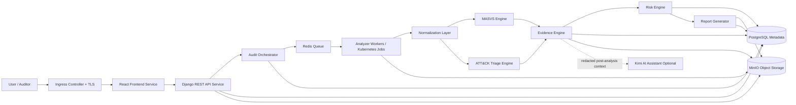

# Architecture Cloud-Native - MSAP Cloud

## Vue d'ensemble
MSAP Cloud est une plateforme cloud-native de security engineering pour l'analyse statique Android, l'evaluation OWASP MASVS, le triage MITRE ATT&CK Mobile, la gestion des preuves et le reporting. L'architecture cible se deploie dans Kubernetes et separe l'interface, l'API, l'orchestration, les workers, les metadonnees et le stockage objet.

## Vue cluster Kubernetes
Le namespace applicatif cible est `msap`. Il contient frontend service, backend API service, worker service, Redis, ConfigMaps, Secrets, Services, Ingress, NetworkPolicies et, pour une installation autonome, PostgreSQL et MinIO avec PVC. PostgreSQL et MinIO peuvent aussi etre fournis par une plateforme institutionnelle.

## Composants
- **Frontend service**: application React exposee via Ingress.
- **Backend API service**: API Django REST pour authentification, projets, audits, uploads, statuts et rapports.
- **Audit Orchestrator**: cree les jobs d'analyse, gere les transitions d'etat et relie objets, metadonnees et preuves.
- **Worker service**: workers Celery ou Kubernetes Jobs executant les analyseurs statiques Android.
- **Redis**: broker de queue et coordination de taches asynchrones.
- **PostgreSQL**: utilisateurs, projets, audits, metadonnees, references MinIO, findings, preuves, scores et rapports.
- **MinIO**: stockage objet des APK, artefacts, preuves, rapports et exports.
- **Ingress + TLS**: point d'entree HTTPS.
- **Kubernetes Secrets**: mots de passe DB, credentials MinIO, cle Django, tokens et configuration sensible.
- **Observabilite**: Prometheus/Grafana optionnels pour metriques, alertes et suivi des workers.

## Stockage objet et jobs d'analyse
Les APK bruts, artefacts d'analyse, snippets de preuves, rapports PDF et exports JSON sont stockes dans MinIO. PostgreSQL ne stocke pas les binaires volumineux; il stocke les references d'objets, hashes, tailles, statuts, proprietaires et politiques de retention. Les analyses longues sont executees hors requete HTTP via Redis et workers ou Kubernetes Jobs.

## Kimi AI optionnel
Kimi AI peut etre active comme assistant post-analyse uniquement. Il consomme un contexte minimal redige depuis les findings, preuves et scores; il ne traite jamais les APK bruts et ne produit pas de classification malware garantie.

## Diagramme d'architecture

