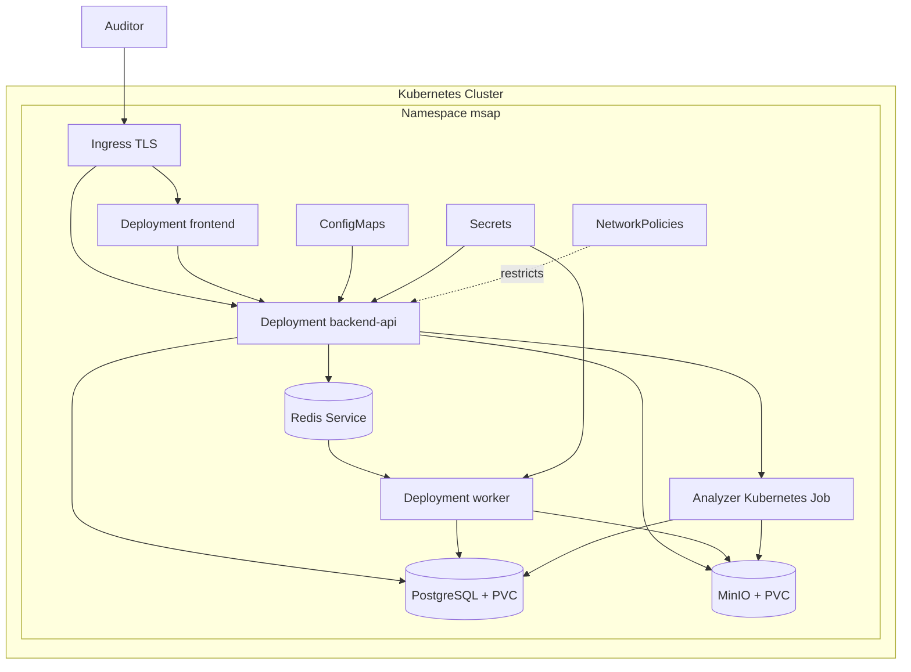

# Architecture de Deploiement Kubernetes - MSAP Cloud

## Ressources Kubernetes
- **Namespace**: `msap` pour isoler les ressources applicatives.
- **Deployments**: `frontend`, `backend-api`, `worker`, `redis`, optionnellement `postgresql` et `minio`.
- **Services**: ClusterIP pour frontend, API, Redis, PostgreSQL et MinIO.
- **Ingress**: exposition HTTPS du frontend et de l'API.
- **ConfigMaps**: configuration non sensible.
- **Secrets**: credentials PostgreSQL, MinIO, cle Django, tokens, configuration Kimi optionnelle.
- **PersistentVolumeClaims**: volumes persistants pour PostgreSQL et MinIO si deployes dans le cluster.
- **Jobs**: analyses APK isolees ou traitements ponctuels.
- **CronJobs**: retention, nettoyage d'objets temporaires, verification de coherence.
- **NetworkPolicies**: restriction des flux internes.
- **ServiceAccounts**: permissions limitees pour API, workers et jobs.

## Deployment flow
Creer le namespace, appliquer Secrets et ConfigMaps, deployer ou connecter PostgreSQL/Redis/MinIO, deployer l'API et ses migrations, deployer les workers, deployer le frontend, activer l'Ingress TLS, puis valider sante API, acces MinIO, queue Redis et job d'analyse.

## Scaling strategy
L'API et le frontend scalent horizontalement par replicas. Les workers scalent selon profondeur de queue, duree moyenne d'analyse et limites CPU/RAM. Les analyses couteuses peuvent etre executees en Kubernetes Jobs avec requests/limits dedies.

## Failure handling
Les taches workers utilisent retries bornes, statuts explicites et conservation des erreurs techniques. Les objets partiels sont marques temporaires et nettoyes. Les probes Kubernetes redemarrent les pods non sains sans masquer les erreurs d'analyse dans PostgreSQL.

## Mermaid deployment diagram

