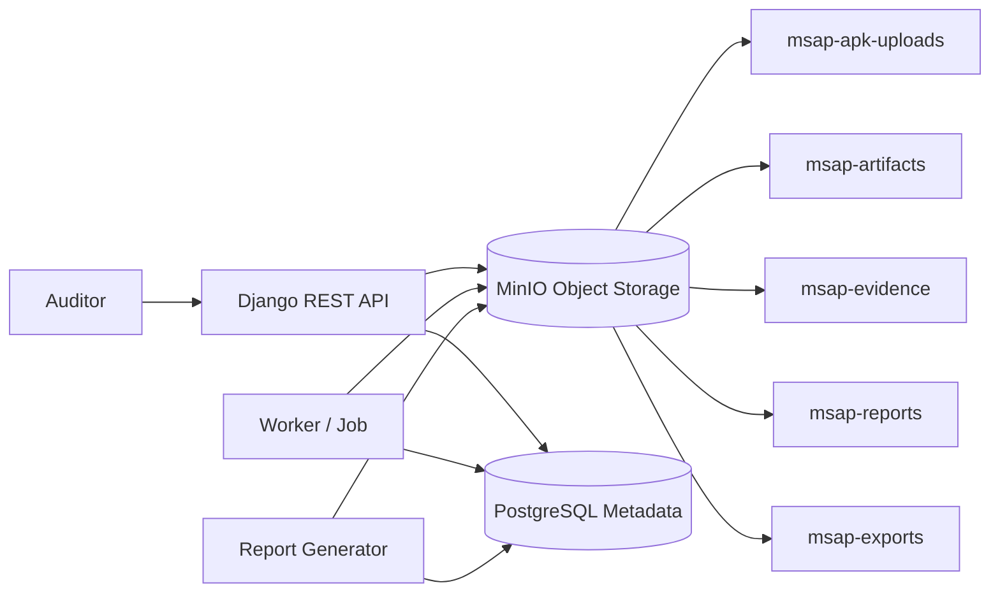

# Architecture de Stockage Objet MinIO - MSAP

## Role de MinIO
MinIO est le stockage objet S3-compatible de MSAP. Il conserve les APK importes, artefacts d'analyse, preuves exportables, rapports PDF et exports JSON. Il n'heberge pas l'application; il stocke uniquement des objets applicatifs.

## Buckets
- `msap-apk-uploads`: APK bruts importes par les auditeurs.
- `msap-artifacts`: manifestes extraits, ressources, resultats d'outils et journaux techniques d'analyse.
- `msap-reports`: rapports PDF.
- `msap-exports`: exports JSON, CSV ou bundles de livraison.
- `msap-evidence`: preuves techniques redigees ou extraites.

## Object naming convention
```text
org/{organization_id}/project/{project_id}/audit/{audit_id}/{category}/{sha256_or_uuid}/{filename}
```
Les noms ne doivent pas exposer de secrets, donnees personnelles ou verdict implicite. Les identifiants opaques et hashes sont preferes.

## Metadata in PostgreSQL
PostgreSQL stocke `bucket`, `object_key`, `version_id`, `sha256`, `size_bytes`, `content_type`, `created_by`, `audit_id`, `retention_policy`, `classification`, `encryption_status` et `deleted_at` logique. Les objets volumineux ne sont pas dupliques en base.

## Retention, confidentiality and encryption
Chaque objet porte une politique: temporaire, audit actif, archive ou export. TLS doit proteger les flux, le chiffrement serveur ou disque doit etre evalue selon le deploiement, et les liens pre-signes doivent etre courts et journalises.

## Access control and lifecycle cleanup
L'application backend est l'intermediaire par defaut. Les utilisateurs n'accedent pas directement aux buckets sauf URL pre-signee limitee. Les credentials MinIO sont dans Kubernetes Secrets. Un CronJob verifie objets orphelins, uploads incomplets, exports expires et references PostgreSQL incoherentes.

## Mermaid data flow

