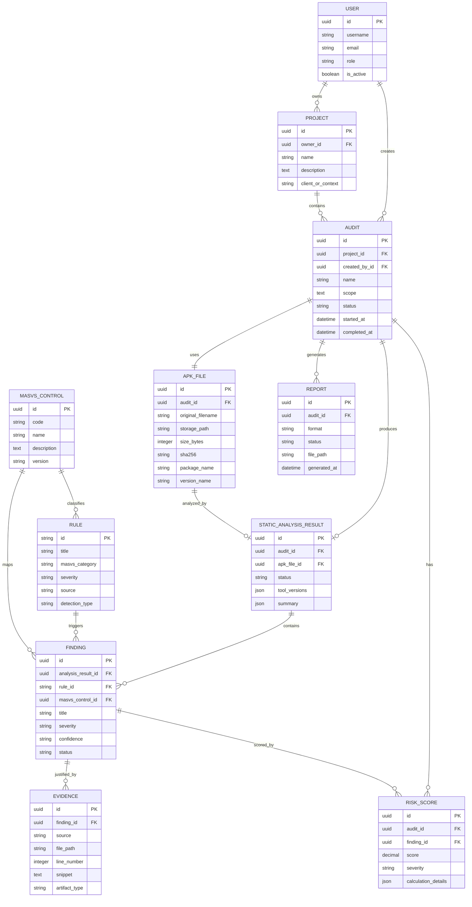

# Modele de Donnees V1 - MSAP

## Objectif

Ce document definit le modele de donnees cible pour la Version 1 de MSAP. Il guide l'implementation Django + PostgreSQL d'une plateforme locale d'audit statique Android, avec tracabilite des APK, resultats, findings, preuves, controles MASVS, scores de risque et rapports.

## Entites du domaine

### User

**Purpose**: representer un utilisateur local de la plateforme, principalement l'auditeur qui cree des projets, lance des analyses et consulte les rapports.

**Main fields**:

- `id`: identifiant technique.
- `username`: nom d'utilisateur.
- `email`: adresse email.
- `password_hash`: mot de passe gere par Django.
- `role`: role fonctionnel, par exemple `admin` ou `auditor`.
- `is_active`: etat du compte.
- `created_at`, `updated_at`: dates de suivi.

**Relationships**:

- Un utilisateur peut posseder plusieurs projets.
- Un utilisateur peut creer plusieurs audits.

### Project

**Purpose**: regrouper les audits lies a un contexte fonctionnel, academique ou applicatif.

**Main fields**:

- `id`: identifiant technique.
- `owner_id`: utilisateur proprietaire.
- `name`: nom du projet.
- `description`: description courte.
- `client_or_context`: contexte d'audit, optionnel.
- `created_at`, `updated_at`: dates de suivi.

**Relationships**:

- Un projet appartient a un utilisateur.
- Un projet contient plusieurs audits.

### Audit

**Purpose**: representer une campagne d'analyse statique pour un APK donne.

**Main fields**:

- `id`: identifiant technique.
- `project_id`: projet rattache.
- `created_by_id`: utilisateur ayant cree l'audit.
- `name`: nom de l'audit.
- `scope`: perimetre declare.
- `status`: `created`, `uploaded`, `running`, `completed`, `failed`.
- `started_at`, `completed_at`: dates d'execution.
- `created_at`, `updated_at`: dates de suivi.

**Relationships**:

- Un audit appartient a un projet.
- Un audit possede un APK principal en Version 1.
- Un audit possede zero ou un resultat d'analyse statique.
- Un audit peut produire plusieurs rapports.

### APKFile

**Purpose**: stocker les metadonnees et le chemin local du fichier APK analyse.

**Main fields**:

- `id`: identifiant technique.
- `audit_id`: audit associe.
- `original_filename`: nom d'origine.
- `stored_filename`: nom local normalise.
- `storage_path`: chemin local controle.
- `size_bytes`: taille du fichier.
- `sha256`: empreinte principale.
- `sha1`: empreinte secondaire optionnelle.
- `md5`: empreinte de compatibilite optionnelle.
- `package_name`: nom de package Android.
- `version_name`: version applicative.
- `version_code`: code version.
- `min_sdk`: SDK minimum.
- `target_sdk`: SDK cible.
- `uploaded_at`: date de depot.

**Relationships**:

- Un APK appartient a un audit.
- Un APK alimente un resultat d'analyse statique.

### StaticAnalysisResult

**Purpose**: representer l'execution d'analyse statique et son etat global.

**Main fields**:

- `id`: identifiant technique.
- `audit_id`: audit analyse.
- `apk_file_id`: APK analyse.
- `status`: `pending`, `running`, `completed`, `failed`.
- `tool_versions`: versions locales des outils utilises, au format JSON.
- `started_at`, `completed_at`: dates de traitement.
- `error_message`: erreur fonctionnelle si echec.
- `summary`: synthese technique au format JSON.

**Relationships**:

- Un resultat appartient a un audit.
- Un resultat concerne un APK.
- Un resultat contient plusieurs findings.

### Finding

**Purpose**: representer un constat de securite issu d'une regle statique.

**Main fields**:

- `id`: identifiant technique.
- `analysis_result_id`: resultat parent.
- `rule_id`: regle declenchee.
- `masvs_control_id`: controle MASVS associe.
- `title`: titre du finding.
- `description`: description du probleme.
- `severity`: severite initiale.
- `confidence`: niveau de confiance, par exemple `low`, `medium`, `high`.
- `status`: `open`, `reviewed`, `false_positive`, `accepted_risk`.
- `impact`: impact securite.
- `recommendation`: recommandation.
- `created_at`: date de detection.

**Relationships**:

- Un finding appartient a un resultat d'analyse.
- Un finding est lie a une regle.
- Un finding est associe a un controle MASVS.
- Un finding possede une ou plusieurs preuves.
- Un finding peut contribuer a un score de risque.

### Evidence

**Purpose**: conserver la preuve technique qui justifie un finding.

**Main fields**:

- `id`: identifiant technique.
- `finding_id`: finding parent.
- `source`: source de preuve, par exemple `AndroidManifest.xml` ou `Decompiled code`.
- `file_path`: chemin relatif dans les artefacts extraits.
- `line_number`: ligne si disponible.
- `snippet`: extrait limite.
- `artifact_type`: `manifest`, `resource`, `code`, `configuration`, `metadata`.
- `confidence`: confiance de la preuve.
- `created_at`: date de collecte.

**Relationships**:

- Une preuve appartient a un finding.

### MASVSControl

**Purpose**: representer une categorie ou un controle MASVS utilise pour classer les findings.

**Main fields**:

- `id`: identifiant technique.
- `code`: code, par exemple `MASVS-NETWORK`.
- `name`: nom lisible.
- `description`: description.
- `version`: version du referentiel retenue pour le projet.

**Relationships**:

- Un controle MASVS peut etre associe a plusieurs regles.
- Un controle MASVS peut etre associe a plusieurs findings.

### Rule

**Purpose**: representer une regle chargee depuis `rules/masvs_static_rules.yaml`.

**Main fields**:

- `id`: identifiant fonctionnel, par exemple `MSAP-AND-001`.
- `title`: titre de la regle.
- `description`: description.
- `masvs_category`: categorie MASVS.
- `severity`: severite par defaut.
- `source`: source analysee.
- `detection_type`: type de detection.
- `pattern_or_condition`: motif ou condition.
- `impact`: impact attendu.
- `recommendation`: recommandation.
- `evidence_example`: exemple de preuve.
- `enabled`: activation locale.

**Relationships**:

- Une regle peut produire plusieurs findings.
- Une regle est associee a une categorie MASVS.

### RiskScore

**Purpose**: stocker le score de risque calcule pour un finding ou pour un audit.

**Main fields**:

- `id`: identifiant technique.
- `audit_id`: audit concerne.
- `finding_id`: finding concerne, optionnel pour un score global.
- `score`: valeur numerique indicative.
- `severity`: niveau final.
- `confidence`: confiance du scoring.
- `calculation_details`: details au format JSON.
- `created_at`: date de calcul.

**Relationships**:

- Un score peut etre rattache a un finding.
- Un score global peut etre rattache uniquement a un audit.

### Report

**Purpose**: representer un rapport local genere a partir d'un audit.

**Main fields**:

- `id`: identifiant technique.
- `audit_id`: audit concerne.
- `format`: `pdf`, `html` ou `markdown` selon les choix MVP.
- `status`: `generated`, `failed`.
- `file_path`: chemin local du rapport.
- `generated_at`: date de generation.
- `summary`: synthese au format JSON.

**Relationships**:

- Un rapport appartient a un audit.
- Un audit peut avoir plusieurs rapports generes.

## ERD

## Hypotheses de conception base de donnees

- PostgreSQL est retenu pour le stockage local structure.
- Les identifiants techniques peuvent etre des UUID pour faciliter les exports et eviter les collisions.
- Les fichiers APK, artefacts extraits et rapports sont stockes sur disque local; la base conserve les chemins controles et les metadonnees.
- Les champs JSON sont reserves aux donnees techniques variables: versions d'outils, syntheses, details de scoring.
- Les snippets de preuve doivent etre limites en taille pour eviter de stocker des secrets complets.
- Les regles YAML peuvent etre chargees au demarrage et synchronisees dans la table `Rule`.
- Les donnees restent locales; aucun modele ne prevoit d'integration cloud dans la Version 1.
