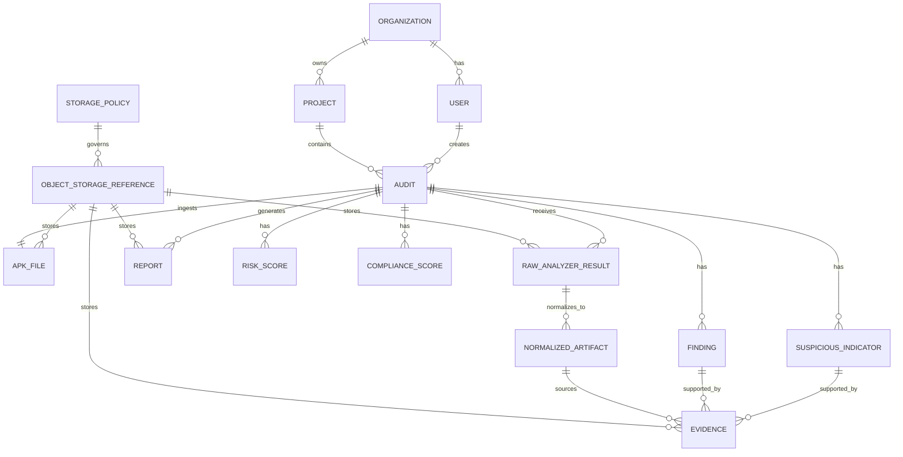

# Modele de Donnees - MSAP Cloud

## Objectif
Ce modele guide l'implementation Django + PostgreSQL de MSAP Cloud. PostgreSQL stocke les metadonnees, references objet, statuts, resultats normalises, findings, indicateurs, preuves, scores et rapports. MinIO stocke les APK, artefacts, preuves volumineuses, rapports et exports.

## Entites principales

### User / Organization / Project
Utilisateurs rattaches a une organisation et a des projets. Les roles supportent Admin, Lead Auditor, Auditor et Viewer.

### Audit
Campagne d'analyse d'un APK. Champs: `id`, `organization_id`, `project_id`, `created_by_id`, `name`, `scope`, `status`, `started_at`, `completed_at`, `retention_policy`.

### ObjectStorageReference
Reference canonique vers MinIO. Champs: `id`, `bucket_name`, `object_key`, `version_id`, `sha256`, `size_bytes`, `content_type`, `storage_policy_id`, `classification`, `created_at`, `deleted_at`.

### BucketName
Enum logique: `msap-apk-uploads`, `msap-artifacts`, `msap-reports`, `msap-exports`, `msap-evidence`.

### ObjectKey
Convention: `org/{organization_id}/project/{project_id}/audit/{audit_id}/{category}/{sha256_or_uuid}/{filename}`.

### StoragePolicy
Politique de retention et confidentialite: `temporary`, `active_audit`, `archive`, `export`, avec duree, chiffrement attendu, suppression et audit.

### APKFile
APK importe. Champs: `id`, `audit_id`, `original_filename`, `object_reference_id`, `size_bytes`, `sha256`, `uploaded_at`, `validation_status`.

### RawAnalyzerResult
Resultat brut produit par un analyseur. Champs: `id`, `audit_id`, `plugin_id`, `artifact_type`, `object_reference_id`, `raw_payload_summary`, `status`, `created_at`.

### NormalizedArtifact
Representation interne commune: permissions, manifest attributes, components, strings, URLs, domains, IPs, certificates, code patterns. Peut referencer un objet MinIO source.

### Finding / SuspiciousIndicator
Findings AppSec mappes OWASP MASVS et indicateurs de triage mappes MITRE ATT&CK Mobile. Aucun champ ne doit representer un verdict malware garanti.

### Evidence
Preuve technique sourcee. Champs: `id`, `audit_id`, `finding_id`, `indicator_id`, `artifact_id`, `object_reference_id`, `source`, `location`, `line_number`, `snippet`, `redacted`, `confidence`.

### Report
Rapport PDF ou export JSON. Champs: `id`, `audit_id`, `format`, `status`, `object_reference_id`, `generated_at`, `summary`.

## ERD

## Assumptions
Les objets volumineux restent dans MinIO. Les references en base sont la source de verite metier. Les preuves contenant des secrets sont masquees. Kimi AI, si active, ne lit que des donnees post-analyse redigees.
