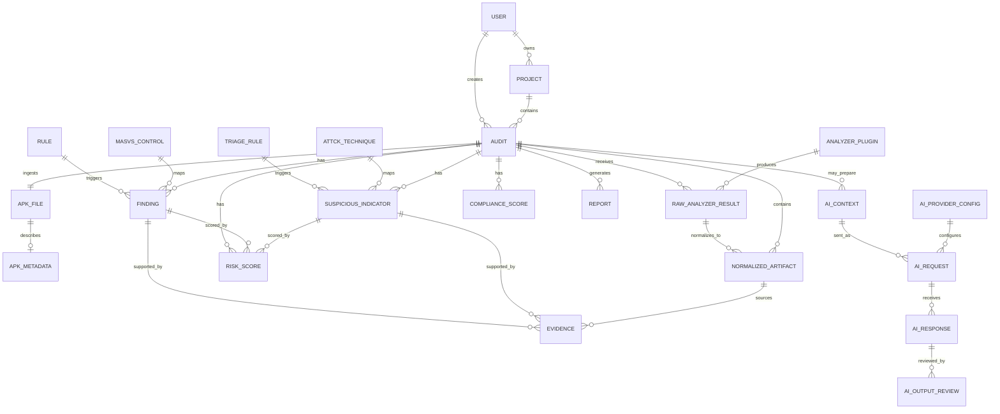

# Modele de Donnees V1 - MSAP

## Objectif

Ce modele guide l'implementation Django + PostgreSQL de MSAP. Il couvre l'audit statique Android, les resultats bruts d'analyse, la normalisation, les findings MASVS, les indicateurs ATT&CK Mobile, les preuves, les scores et les rapports.

## Entites

### User

**Purpose**: utilisateur local, auditeur ou administrateur.

**Main fields**: `id`, `username`, `email`, `password_hash`, `role`, `is_active`, `created_at`.

**Relationships**: possede des projets et cree des audits.

### Project

**Purpose**: regrouper des audits lies a un contexte institutionnel ou applicatif.

**Main fields**: `id`, `owner_id`, `name`, `description`, `context`, `created_at`.

**Relationships**: appartient a un User, contient des Audits.

### Audit

**Purpose**: campagne d'analyse d'un APK.

**Main fields**: `id`, `project_id`, `created_by_id`, `name`, `scope`, `status`, `started_at`, `completed_at`.

**Relationships**: contient APKFile, resultats, findings, indicateurs, scores et rapports.

### APKFile

**Purpose**: fichier APK importe localement.

**Main fields**: `id`, `audit_id`, `original_filename`, `stored_filename`, `storage_path`, `size_bytes`, `sha256`, `uploaded_at`.

**Relationships**: appartient a un Audit, possede APKMetadata.

### APKMetadata

**Purpose**: metadonnees techniques extraites.

**Main fields**: `id`, `apk_file_id`, `package_name`, `version_name`, `version_code`, `min_sdk`, `target_sdk`, `certificate_subject`, `certificate_issuer`, `signature_scheme`, `extracted_at`.

**Relationships**: appartient a APKFile.

### AnalyzerPlugin

**Purpose**: representer un adaptateur d'analyse local.

**Main fields**: `id`, `name`, `plugin_type`, `version`, `enabled`, `description`.

**Relationships**: produit des RawAnalyzerResult.

### RawAnalyzerResult

**Purpose**: resultat brut produit par un plugin avant normalisation.

**Main fields**: `id`, `audit_id`, `plugin_id`, `artifact_type`, `file_path`, `raw_payload`, `status`, `created_at`.

**Relationships**: appartient a Audit et AnalyzerPlugin; alimente NormalizedArtifact.

### NormalizedArtifact

**Purpose**: representation interne commune des artefacts.

**Main fields**: `id`, `audit_id`, `raw_result_id`, `artifact_type`, `key`, `value`, `location`, `metadata`, `created_at`.

**Relationships**: alimente Rule, TriageRule, Finding, SuspiciousIndicator et Evidence.

### Finding

**Purpose**: faiblesse AppSec mappee OWASP MASVS.

**Main fields**: `id`, `audit_id`, `rule_id`, `masvs_control_id`, `title`, `severity`, `confidence`, `status`, `impact`, `recommendation`.

**Relationships**: lie a Rule, MASVSControl, Evidence, RiskScore.

### SuspiciousIndicator

**Purpose**: indicateur de triage mappe MITRE ATT&CK Mobile.

**Main fields**: `id`, `audit_id`, `triage_rule_id`, `attck_technique_id`, `title`, `severity`, `confidence`, `triage_interpretation`, `analyst_status`.

**Relationships**: lie a TriageRule, ATTCKTechnique, Evidence, RiskScore.

### Evidence

**Purpose**: preuve technique sourcee.

**Main fields**: `id`, `audit_id`, `finding_id`, `indicator_id`, `artifact_id`, `source`, `file_path`, `line_number`, `snippet`, `redacted`, `confidence`.

**Relationships**: appartient a un finding ou indicateur.

### MASVSControl

**Purpose**: categorie ou controle OWASP MASVS.

**Main fields**: `id`, `code`, `name`, `description`, `version`.

**Relationships**: associe a Rules et Findings.

### ATTCKTechnique

**Purpose**: technique MITRE ATT&CK Mobile referencee.

**Main fields**: `id`, `technique_id`, `technique_name`, `tactic`, `platform`, `description`.

**Relationships**: associe a TriageRules et SuspiciousIndicators.

### Rule

**Purpose**: regle AppSec chargee depuis `masvs_static_rules.yaml`.

**Main fields**: `id`, `standard`, `title`, `masvs_category`, `severity`, `confidence`, `source`, `detection_type`, `pattern_or_condition`, `enabled`.

**Relationships**: produit des Findings.

### TriageRule

**Purpose**: regle de triage chargee depuis `attck_mobile_triage_rules.yaml`.

**Main fields**: `id`, `standard`, `title`, `tactic`, `technique_id`, `technique_name`, `severity`, `confidence`, `source`, `detection_type`, `pattern_or_condition`, `enabled`.

**Relationships**: produit des SuspiciousIndicators.

### RiskScore

**Purpose**: score de risque par audit, finding ou indicateur.

**Main fields**: `id`, `audit_id`, `finding_id`, `indicator_id`, `score`, `severity`, `calculation_details`, `created_at`.

**Relationships**: rattache a Audit et optionnellement Finding ou SuspiciousIndicator.

### ComplianceScore

**Purpose**: score indicatif de conformite MASVS.

**Main fields**: `id`, `audit_id`, `standard`, `category`, `score`, `passed_rules`, `failed_rules`, `not_applicable_rules`, `created_at`.

**Relationships**: appartient a Audit.

### Report

**Purpose**: rapport PDF ou export JSON.

**Main fields**: `id`, `audit_id`, `format`, `status`, `file_path`, `generated_at`, `summary`.

**Relationships**: appartient a Audit.

## ERD

## Database Design Assumptions

- PostgreSQL stocke les metadonnees, resultats normalises, preuves, mappings et scores.
- Les APK, artefacts volumineux, PDF et JSON restent sur disque local.
- Les champs JSON servent aux payloads bruts, details de scoring et metadonnees variables.
- Les preuves contenant des secrets doivent etre tronquees ou masquees.
- Les statuts analyste permettent la gestion des faux positifs.
- Les rules YAML sont chargees et validees avant execution.

## Optional AI V1.1 Entities

### AIContext

**Purpose**: contexte minimal et redige construit depuis les findings, indicateurs, preuves et scores deterministes.

**Main fields**: `id`, `audit_id`, `purpose`, `context_hash`, `redaction_summary`, `created_by`, `created_at`.

### AIRequest

**Purpose**: trace d'une demande AI optionnelle.

**Main fields**: `id`, `ai_context_id`, `provider`, `model`, `prompt_template`, `status`, `latency_ms`, `created_at`.

### AIResponse

**Purpose**: brouillon produit par l'assistant AI.

**Main fields**: `id`, `ai_request_id`, `output_type`, `draft_text`, `referenced_ids`, `created_at`.

### AIOutputReview

**Purpose**: validation humaine d'une sortie AI.

**Main fields**: `id`, `ai_response_id`, `state`, `reviewer_id`, `review_notes`, `reviewed_at`.

### AIProviderConfig

**Purpose**: configuration optionnelle du fournisseur AI.

**Main fields**: `id`, `provider`, `model`, `enabled`, `timeout_seconds`, `redaction_enabled`, `created_at`.

Ces entites sont une extension optionnelle V1.1. Elles ne sont pas requises pour le fonctionnement local-first V1.
