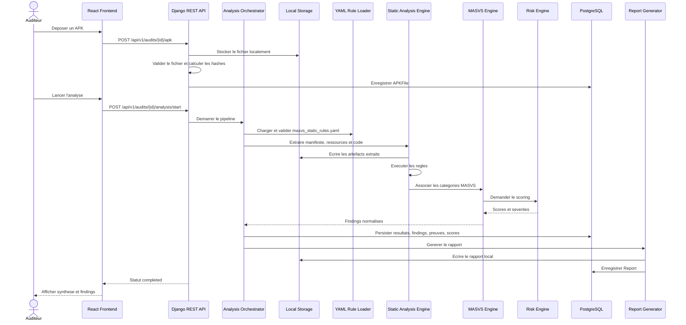
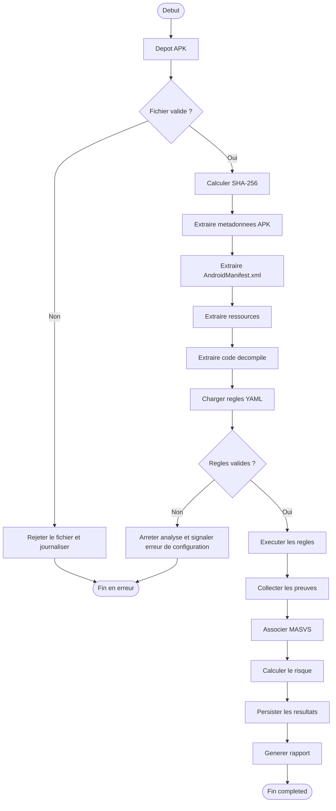

# Pipeline d'Analyse Statique APK V1 - MSAP

## Objectif

Ce document definit le pipeline technique de la Version 1 de MSAP. Le pipeline couvre uniquement l'analyse statique locale d'un fichier APK Android et exclut MobSF, Frida, l'emulateur Android, l'analyse dynamique et iOS.

## Entrees du pipeline

- Fichier APK fourni par l'utilisateur.
- Contexte d'audit: projet, nom d'audit, perimetre declare.
- Catalogue de regles `rules/masvs_static_rules.yaml`.
- Configuration locale: chemins de stockage, limites de taille, options d'extraction.

## Sorties du pipeline

- Metadonnees APK: hash, package, version, SDK.
- Artefacts extraits: manifeste, ressources, code decompile, configurations.
- Findings normalises.
- Preuves techniques associees.
- Mapping MASVS.
- Scores de risque.
- Rapport local.
- Journal technique d'execution.

## Etapes du pipeline

### 1. APK upload

L'utilisateur depose un fichier APK via l'interface. Le backend stocke le fichier dans un repertoire local controle associe a l'audit.

### 2. File validation

Le backend verifie l'extension, la taille, la presence du fichier, le type attendu et la lisibilite. La validation ne doit pas executer le contenu de l'APK.

### 3. Hash calculation

Le backend calcule au minimum le hash SHA-256. Des hashes SHA-1 et MD5 peuvent etre conserves a titre de compatibilite documentaire.

### 4. Metadata extraction

Le moteur extrait les metadonnees principales: nom de package, version, SDK minimum, SDK cible et informations de signature si disponibles.

### 5. Manifest extraction

Le pipeline extrait et parse `AndroidManifest.xml` pour identifier les permissions, composants exportes, attributs applicatifs et configurations de securite.

### 6. Resource extraction

Les ressources textuelles et fichiers de configuration sont extraits pour rechercher URLs, secrets potentiels et fichiers comme `network_security_config.xml`.

### 7. Decompiled code extraction

Le code decompile ou representation equivalente est prepare pour les detections par motifs. Cette etape reste locale et ne lance pas l'application.

### 8. Rule loading from YAML

Le backend charge `rules/masvs_static_rules.yaml`, valide son schema et prepare les regles actives.

### 9. Rule execution

Le moteur applique les regles selon leur `source` et `detection_type`: conditions de manifeste, motifs de chaines, regex, heuristiques ou analyse XML.

### 10. Evidence collection

Chaque detection doit produire au moins une preuve: source, fichier, extrait limite, ligne si disponible, type d'artefact et confiance.

### 11. MASVS mapping

Chaque finding est associe a la categorie MASVS indiquee par la regle, par exemple `MASVS-NETWORK` ou `MASVS-PLATFORM`.

### 12. Risk scoring

Le moteur de risque calcule une severite finale et un score indicatif a partir de la severite de la regle, la confiance, l'exposition et le contexte.

### 13. Result persistence

Les resultats sont persistés dans PostgreSQL. Les fichiers extraits restent sur disque local avec des chemins references en base.

### 14. Report generation

Le generateur produit un rapport local contenant le perimetre, les limites, la synthese, les findings, les preuves et les recommandations.

## Sequence diagram

## Activity diagram

## Gestion des echecs

- **Upload invalide**: retourner une erreur `400`, ne pas creer de resultat d'analyse.
- **APK illisible ou corrompu**: marquer l'audit `failed`, conserver le message d'erreur fonctionnel.
- **Extraction partielle**: poursuivre si possible et indiquer les artefacts manquants dans le resultat.
- **Erreur de schema YAML**: bloquer l'analyse, car les regles ne sont pas fiables.
- **Erreur d'execution d'une regle**: journaliser l'erreur, marquer la regle comme echouee dans la synthese et continuer les autres regles si possible.
- **Erreur de reporting**: conserver les resultats d'analyse et marquer uniquement le rapport `failed`.

## Exigences de journalisation

- Journaliser le debut et la fin de chaque etape.
- Inclure `audit_id`, `apk_file_id`, `analysis_result_id` et duree d'execution.
- Ne jamais journaliser un secret complet detecte.
- Journaliser les erreurs techniques avec stack trace cote serveur uniquement.
- Journaliser les erreurs fonctionnelles avec message comprehensible pour l'utilisateur.
- Conserver une synthese d'execution dans `StaticAnalysisResult.summary`.
