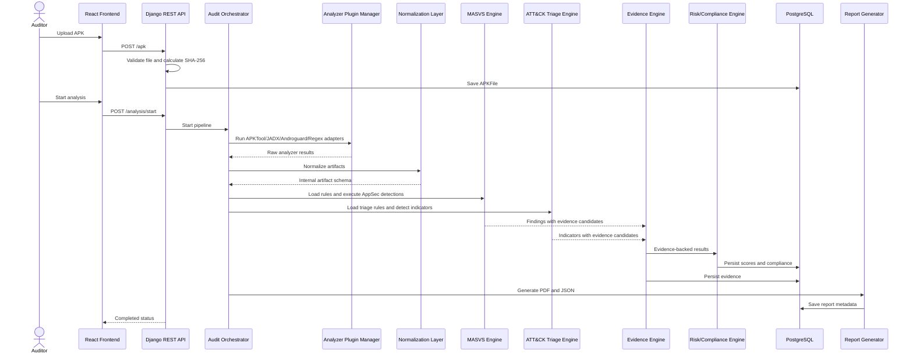
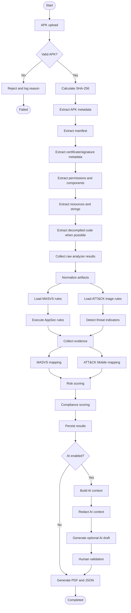

# Pipeline d'Analyse Statique et de Triage APK - MSAP V1

## Pipeline

1. APK upload.
2. File validation.
3. Hash calculation.
4. APK metadata extraction.
5. Manifest extraction.
6. Certificate/signature metadata extraction.
7. Permission and component extraction.
8. Resource and string extraction.
9. Decompiled code extraction when possible.
10. Raw analyzer result collection.
11. Normalization into internal artifact schema.
12. MASVS rule loading.
13. ATT&CK triage rule loading.
14. AppSec rule execution.
15. Threat indicator detection.
16. Evidence collection.
17. MASVS mapping.
18. ATT&CK Mobile mapping.
19. Risk scoring.
20. Compliance scoring.
21. Result persistence.
22. Optional AI enrichment if enabled.
23. Report generation.

## Inputs

- APK autorise.
- Projet et audit.
- `rules/masvs_static_rules.yaml`.
- `rules/attck_mobile_triage_rules.yaml`.
- Configuration locale des chemins et limites.

## Outputs

- APKMetadata.
- RawAnalyzerResult.
- NormalizedArtifact.
- Findings MASVS.
- SuspiciousIndicators ATT&CK Mobile.
- Evidence.
- RiskScore et ComplianceScore.
- Rapport PDF et export JSON.

## Sequence Diagram

## Activity Diagram

## Optional Post-Scoring AI Enrichment

The AI enrichment step is optional V1.1 and occurs only after deterministic risk and compliance scoring. It may prepare redacted draft text before final report generation, but it cannot change findings, indicators, evidence or scores.

## Failure Handling

- Invalid upload: return `400`, no analysis launched.
- Tool unavailable: mark plugin result failed and continue when non-critical.
- YAML invalid: block analysis because rules are not trustworthy.
- Partial extraction: continue with missing-artifact warning.
- Rule failure: log rule ID and continue other rules.
- Reporting failure: keep analysis results and mark report failed.
- AI unavailable or disabled: continue report generation without AI content.

## Logging Requirements

- Include `audit_id`, `apk_file_id`, plugin name, step and duration.
- Never log full secrets or complete sensitive snippets.
- Distinguish analyst-facing errors from technical debug logs.
- Keep local logs only.
