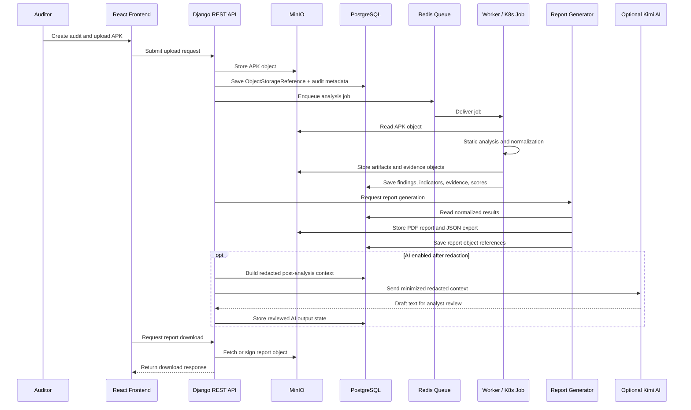

# Modele de Flux de Donnees Cloud - MSAP

## Upload flow
L'auditeur cree un audit puis transmet un APK via l'API. Deux modeles sont acceptables: upload backend-medie ou URL pre-signee courte. L'objet final est stocke dans `msap-apk-uploads`, et PostgreSQL conserve la reference MinIO, le hash, la taille, le proprietaire, le projet et le statut.

## Analysis flow
L'API place une tache dans Redis. Un worker ou Kubernetes Job recupere l'APK depuis MinIO, execute les analyseurs statiques, depose les artefacts dans `msap-artifacts`, normalise les resultats, cree les findings MASVS, les indicateurs ATT&CK Mobile, les preuves et les scores.

## Report generation flow
Le generateur lit les donnees normalisees et les preuves referencees, produit un PDF et un export JSON, puis les stocke dans `msap-reports` et `msap-exports`. PostgreSQL stocke les references et statuts de generation.

## References and traceability
PostgreSQL est la source de verite pour l'etat metier. MinIO est la source de verite pour les binaires et artefacts volumineux. Chaque preuve relie audit, regle, artefact normalise, reference objet, emplacement, confiance et statut de redaction.

## AI redaction flow if enabled
Kimi AI recoit uniquement un contexte post-analyse minimal et redige depuis findings, indicateurs, scores et preuves redigees. L'AI ne recoit ni APK brut, ni artefacts complets sensibles, ni secrets non masques.

## Mermaid sequence diagram

