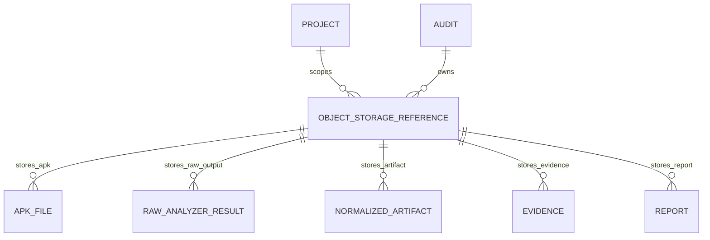

# ObjectStorageReference Schema - MSAP

## Purpose
`ObjectStorageReference` is the canonical metadata record that links MSAP business entities to objects stored in MinIO. It gives the backend, workers, evidence engine and report generator a stable way to locate APK uploads, analyzer artifacts, evidence material, reports and exports without storing large binary payloads in PostgreSQL.

## Storage Principle
APKs, extracted files, decompiled archives, raw analyzer output, normalized artifacts that are too large for rows, evidence snippets, PDF reports and JSON exports are stored in MinIO because they are binary or semi-structured objects, may be large, need lifecycle policies, and are better handled by S3-compatible object storage.

PostgreSQL stores metadata and object references only: audit status, ownership, hashes, sizes, object keys, security labels, scoring, normalized summaries and relationships. This keeps database backups smaller, preserves query performance, and allows MinIO lifecycle controls to manage large objects.

## Entity Fields
| Field | Purpose |
|---|---|
| `id` | Stable database identifier for the object reference. |
| `bucket` | MinIO bucket containing the object. |
| `object_key` | Full object key inside the bucket. |
| `object_type` | Logical object category. |
| `content_type` | MIME type or controlled content descriptor. |
| `size_bytes` | Object size in bytes. |
| `sha256` | SHA-256 digest for integrity and deduplication checks. |
| `created_at` | Timestamp when the reference was created. |
| `created_by` | User, service account or worker that created the reference. |
| `audit_id` | Audit associated with the object. |
| `project_id` | Project boundary for authorization and cleanup. |
| `retention_policy` | Retention class such as `active_audit`, `temporary`, `archive` or `export`. |
| `encryption_status` | Encryption state expected or verified for the object. |
| `redaction_status` | Redaction state: `not_required`, `pending`, `redacted` or `blocked`. |
| `access_scope` | Access boundary such as `project`, `audit`, `worker_internal` or `export`. |

## Object Types
- `APK_UPLOAD`
- `EXTRACTED_MANIFEST`
- `EXTRACTED_RESOURCE`
- `DECOMPILED_CODE_ARCHIVE`
- `RAW_ANALYZER_RESULT`
- `NORMALIZED_ARTIFACT`
- `EVIDENCE_SNIPPET`
- `PDF_REPORT`
- `JSON_EXPORT`
- `AI_REDACTED_CONTEXT`

## MinIO Bucket Mapping
| Bucket | Object types |
|---|---|
| `msap-apk-uploads` | `APK_UPLOAD` |
| `msap-artifacts` | `EXTRACTED_MANIFEST`, `EXTRACTED_RESOURCE`, `DECOMPILED_CODE_ARCHIVE`, `RAW_ANALYZER_RESULT`, `NORMALIZED_ARTIFACT`, `AI_REDACTED_CONTEXT` |
| `msap-evidence` | `EVIDENCE_SNIPPET` |
| `msap-reports` | `PDF_REPORT` |
| `msap-exports` | `JSON_EXPORT` |

## Object Key Naming Convention
Canonical pattern:

```text
org/{organization_id}/project/{project_id}/audit/{audit_id}/{object_type}/{sha256_or_uuid}/{safe_filename}
```

Rules:
- Object keys must include organization, project and audit identifiers.
- `object_type` must match the controlled enum.
- `safe_filename` must be sanitized and must not be trusted as an authorization boundary.
- Hash-based keys are preferred for immutable APKs and reports.
- UUID-based keys are acceptable for generated temporary or intermediate artifacts.
- Object keys must not contain raw user-controlled path segments.

## Object Key Examples
```text
org/org_123/project/prj_456/audit/aud_789/APK_UPLOAD/9f86d081884c7d659a2feaa0c55ad015/app-release.apk
org/org_123/project/prj_456/audit/aud_789/EXTRACTED_MANIFEST/5b31c2d0/AndroidManifest.xml
org/org_123/project/prj_456/audit/aud_789/RAW_ANALYZER_RESULT/7f3d9c4a/apktool-result.json
org/org_123/project/prj_456/audit/aud_789/EVIDENCE_SNIPPET/f9a11e8c/exported-receiver.json
org/org_123/project/prj_456/audit/aud_789/PDF_REPORT/5c44ad92/msap-report.pdf
org/org_123/project/prj_456/audit/aud_789/JSON_EXPORT/4d7ef9a1/msap-export.json
org/org_123/project/prj_456/audit/aud_789/AI_REDACTED_CONTEXT/1dd6f0e5/context.json
```

## Entity Relationships
- `APKFile` owns one `ObjectStorageReference` with type `APK_UPLOAD`.
- `RawAnalyzerResult` references raw analyzer output stored in `msap-artifacts`.
- `NormalizedArtifact` may reference a compact database record and optionally a larger MinIO artifact.
- `Evidence` may store short redacted snippets in PostgreSQL and larger evidence objects in `msap-evidence`.
- `Report` references generated PDF reports in `msap-reports` and JSON exports in `msap-exports`.

## Security Rules
- Buckets are private by default.
- Users never access MinIO directly for authorization decisions; the backend enforces project and audit access.
- Workers receive least-privilege credentials for required read/write paths.
- Raw APK objects must never be sent to optional AI providers.
- AI context objects must be redacted and tagged `AI_REDACTED_CONTEXT`.
- `sha256`, `size_bytes` and `content_type` must be validated after upload.
- Pre-signed URLs, if used, must be short-lived and scoped to a single object.
- Object references must be audit logged on create, read, export and delete operations.

## Retention and Cleanup Rules
- APK uploads follow the audit or project retention policy.
- Temporary analyzer artifacts may be deleted after normalization when no evidence depends on them.
- Evidence and reports follow the audit retention policy and require explicit cleanup records.
- Expired exports are removed from `msap-exports` by lifecycle or cleanup job.
- PostgreSQL references must not be deleted before MinIO cleanup is confirmed or tombstoned.
- Cleanup must detect orphaned MinIO objects and dangling database references.

## Mermaid ERD Update Snippet

